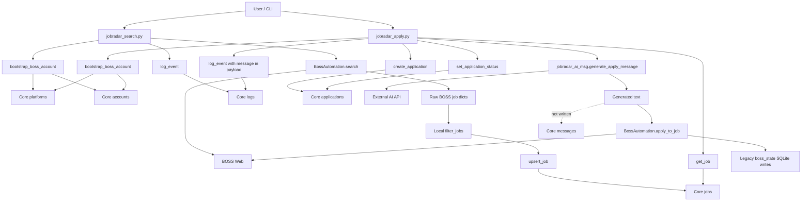
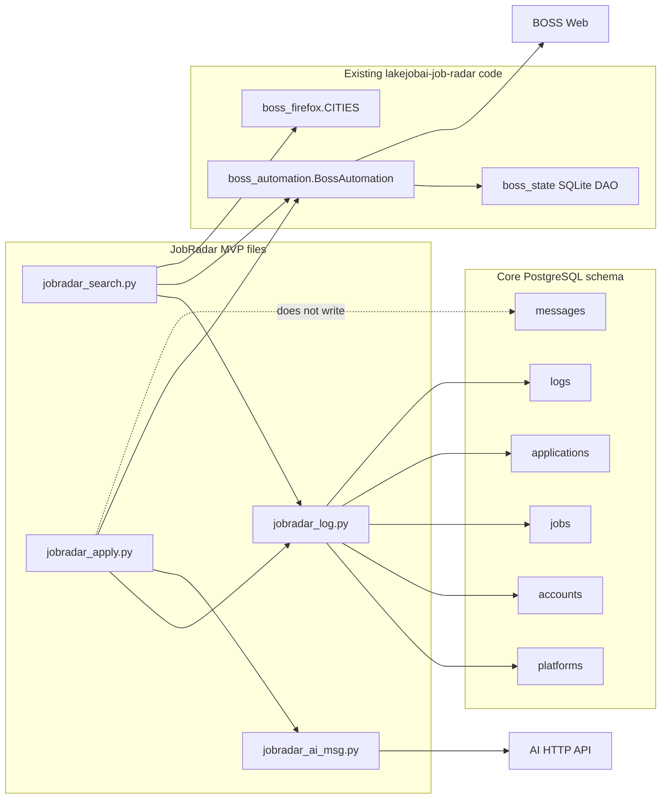

# Architecture Validation

验收对象：

- `schema.sql`
- `jobradar_search.py`
- `jobradar_apply.py`
- `jobradar_ai_msg.py`
- `jobradar_log.py`
- 现有 BossAdapter 素材：`lakejobai-job-radar/boss_automation.py`, `boss_firefox.py`

验收目标：确认 LakeJob Core + BossAdapter + JobRadar MVP 是否形成可长期演化的闭环。

结论：**当前只形成了部分闭环，不具备稳定长期演化能力。**

关键原因：

1. 搜索结果会写入 Core `jobs` 表。
2. 投递动作会写入 Core `applications` 表。
3. AI 生成的投递消息不会写入 Core `messages` 表，只被放进 `logs.payload`。
4. 日志会写入 Core `logs` 表。
5. JobRadar 确实调用了现有 BOSS 自动化代码，但不是通过抽象 BossAdapter，而是直接导入 `BossAutomation`。
6. `BossAutomation.apply_to_job()` 内部仍会写旧 SQLite `boss_state.py`，因此存在绕过 Core 数据库的写入行为。
7. JobRadar MVP 代码硬编码 BOSS 平台、BOSS 城市表、BOSS prompt 和 BOSS 自动化类。
8. 当前结构无法平滑扩展到猎聘/智联或 RecruitRadar，除非先抽象平台适配器和 Core Repository。

## Validation Matrix

| 检查项 | 验收结果 | 证据 |
|---|---|---|
| JobRadar 搜索岗位是否写入 `jobs` 表 | 部分通过 | `jobradar_search.py` 调用 `upsert_job()`；`jobradar_log.py` 中 `upsert_job()` 执行 `INSERT INTO jobs` |
| JobRadar 投递岗位是否写入 `applications` 表 | 部分通过 | `jobradar_apply.py` 调用 `create_application()` 和 `set_application_status()`；`jobradar_log.py` 写 `applications` |
| AI 生成消息是否写入 `messages` 表 | 未通过 | `jobradar_ai_msg.py` 只返回字符串；`jobradar_apply.py` 把消息传给 `BossAutomation.apply_to_job()`，并写入 `logs.payload`，没有 Core `messages` 写入 |
| 日志是否写入 `logs` 表 | 通过 | `jobradar_search.py` 和 `jobradar_apply.py` 都调用 `log_event()`；`jobradar_log.py` 执行 `INSERT INTO logs` |
| BossAdapter 是否被 JobRadar 调用 | 部分通过 | JobRadar 调用了 `BossAutomation`，但不是架构设计中的 `PlatformAdapter` 或 `BossAdapter` 接口 |
| 是否绕过 Core 数据库直接写数据 | 未通过 | `BossAutomation` 直接导入并调用 `boss_state.add_application/update_application_status/add_message/increment_daily_stat` 等旧 SQLite DAO |
| 是否硬编码 Boss 数据结构 | 未通过 | `jobradar_search.py` 直接导入 `boss_firefox.CITIES`；`jobradar_ai_msg.py` prompt 写死 “BOSS job application greeting”；`jobradar_log.py` 默认 `platform code = boss` |
| 是否可扩展到猎聘/智联 | 未通过 | 无平台接口；搜索和投递直接依赖 `BossAutomation` |
| 是否可扩展到 RecruitRadar | 未通过 | 文件命名、账号类型、方向、prompt 和工作流全是 JobRadar 求职语境 |

## A. 当前数据流图

## B. 当前调用链图

## C. 架构缺陷清单

### C1. AI 消息没有进入 Core `messages`

现状：

- `jobradar_ai_msg.py` 只返回 AI 生成文本。
- `jobradar_apply.py` 把文本传给 `BossAutomation.apply_to_job()`。
- `jobradar_apply.py` 只把 AI 文本放入 `logs.payload.message`。
- 没有任何 `INSERT INTO messages`。

影响：

- 无法在 Core 中追踪投递消息。
- 无法形成统一会话/消息审计。
- 后续自动聊天无法复用这条消息历史。

验收结论：**不通过。**

### C2. BossAdapter 没有以 Adapter 形式存在

现状：

- `jobradar_search.py` 直接导入 `BossAutomation`。
- `jobradar_apply.py` 直接导入 `BossAutomation`。
- 没有 `PlatformAdapter` 接口。
- 没有 `BossAdapter.search_jobs/apply/send_message` 抽象。

影响：

- JobRadar 与 Boss 具体实现强耦合。
- 猎聘/智联无法替换。
- RecruitRadar 无法复用同一平台层。

验收结论：**部分通过，实际是调用了 Boss 自动化代码，但不符合 BossAdapter 架构目标。**

### C3. 存在绕过 Core 的旧 SQLite 写入

现状：

`boss_automation.py` 内部直接导入：

- `add_application`
- `update_application_status`
- `get_or_create_conversation`
- `add_message`
- `replace_conversation_messages`
- `increment_daily_stat`

这些来自 `boss_state.py`，写入旧 `.boss_profile/boss_state.db`。

影响：

- 同一次投递会写 Core `applications`，也可能写旧 SQLite `applications`。
- Core 和旧 SQLite 状态可能分裂。
- Core 无法成为唯一事实来源。

验收结论：**不通过。**

### C4. Core ORM 不存在

现状：

- 当前只有 `schema.sql`。
- `jobradar_log.py` 使用手写 SQL。
- 没有 ORM 模型、Repository 类、Unit of Work 或 Core package。

影响：

- “所有数据均调用 Core ORM/Schema”只能满足 Schema，未满足 ORM。
- 后续维护会继续散写 SQL。
- 数据访问规则无法集中治理。

验收结论：**部分通过，调用了 Core Schema，但没有 Core ORM。**

### C5. 平台和产品语义硬编码

现状：

- `jobradar_log.py` 默认创建 `boss` 平台。
- `jobradar_search.py` 直接使用 `boss_firefox.CITIES`。
- `jobradar_ai_msg.py` prompt 写死 “BOSS job application greeting”。
- `jobradar_apply.py` 使用 `BossAutomation.apply_to_job()`。
- 默认账号名是 `default-jobseeker`。

影响：

- 无法扩展多平台。
- 无法扩展多账号。
- 招聘端不能复用。

验收结论：**不通过。**

### C6. 搜索筛选逻辑没有进入 Strategy

现状：

- 技能、经验、地区筛选写在 `jobradar_search.py` 的本地函数中。
- 未读取 Core `strategies`。
- 未写入策略执行记录。

影响：

- 筛选不可配置、不可审计、不可复用。
- RecruitRadar 候选筛选无法复用。

验收结论：**不通过。**

### C7. 调度系统完全未接入

现状：

- `tasks` 表存在于 schema。
- MVP 没有创建 `tasks` 或 `task_runs`。
- 搜索/投递都是同步 CLI 风格调用。

影响：

- 自动搜索、定时投递、周期同步无法形成可审计任务链。

验收结论：**不通过。**

### C8. Application 状态双轨

现状：

- Core schema 使用 `pending/submitted/responded/rejected`。
- JobRadar MVP 输出 `Applied/Waiting/Interview/Rejected`。
- 映射结果放入 log payload。

影响：

- 产品状态和 Core 状态没有正式模型。
- 后续统计可能使用不同口径。

验收结论：**可临时接受，但必须规范化。**

## D. 未来扩展阻塞项

| 阻塞项 | 阻塞影响 | 严重性 |
|---|---|---|
| 没有 `PlatformAdapter` 接口 | 猎聘/智联无法平滑接入 | P0 |
| Boss 自动化内部写旧 SQLite | Core 不能成为唯一事实来源 | P0 |
| 没有 Core ORM/Repository | 数据访问继续散落 | P0 |
| `messages` 表未写入 AI 投递消息 | 会话系统闭环缺失 | P0 |
| JobRadar 直接依赖 BossAutomation | 产品层和平台层耦合 | P0 |
| 搜索筛选逻辑不走 Strategy | 策略不可复用到 RecruitRadar | P1 |
| 没有 Task/TaskRun 写入 | 调度系统没有数据闭环 | P1 |
| 平台城市表直接使用 Boss CITIES | 平台地域模型无法统一 | P1 |
| AI prompt 写死 BOSS 求职语境 | 招聘端和多平台不可复用 | P1 |
| 旧 `boss_state.py` 和 Core schema 并存 | 数据一致性风险 | P0 |

## E. 必须重构项

| 优先级 | 重构项 | 目标 |
|---:|---|---|
| P0 | 建立 Core Repository/ORM | 所有写入必须经过 Core 数据访问层 |
| P0 | 把 `BossAutomation` 包装成 `BossAdapter` | JobRadar 只依赖 adapter 接口 |
| P0 | 禁止 BossAdapter 写旧 SQLite | Core 成为唯一事实来源 |
| P0 | 投递消息写入 Core `messages` | AI 消息、人工消息、平台消息统一入库 |
| P0 | 创建 Conversation 写入链路 | 投递消息必须挂到 conversation |
| P1 | Strategy 接管筛选条件 | 技能/经验/地区筛选可配置、可审计 |
| P1 | Task/TaskRun 接管搜索/投递执行 | 自动搜索和投递形成调度闭环 |
| P1 | Platform capability 和 region mapping | Boss/猎聘/智联统一平台能力与地区模型 |
| P1 | 统一产品状态映射 | JobRadar 状态和 Core 状态不再靠 log payload |
| P2 | 将 AI prompt 移出脚本 | AI 只作为产品策略，不嵌在平台或 Core |

## F. 建议立即修复项

这些不是新功能，而是闭环修复前置项：

1. **先停用直接调用 `BossAutomation.apply_to_job()` 的生产路径。**
   当前它会写旧 SQLite，导致 Core 和 legacy 数据双写分裂。

2. **建立最小 `CoreRepository`。**
   至少覆盖 `jobs/applications/conversations/messages/logs`，替代 `jobradar_log.py` 中散写 SQL。

3. **建立 `BossAdapter` 包装层。**
   JobRadar 只能调用 `BossAdapter.search_jobs()` 和 `BossAdapter.apply_job()`，不能直接导入 `BossAutomation`。

4. **在投递前创建 Core `conversation`，投递消息写入 `messages`。**
   当前 AI 文本只在 `logs.payload`，不构成消息系统闭环。

5. **把 Boss legacy SQLite 写入隔离掉。**
   BossAdapter 应返回平台动作结果，由 JobRadar/Core 决定写入 Core；不要在平台动作内部写状态库。

6. **把筛选参数写入 `strategies` 或任务 payload。**
   否则无法审计“为什么这个岗位被投递”。

7. **每次搜索/投递创建 `tasks/task_runs`。**
   当前日志有了，但调度骨架没有参与闭环。

8. **统一状态模型。**
   将 `Applied/Waiting/Interview/Rejected` 明确映射为产品展示状态表或 metadata，而不是散落在日志 payload。

## Final Assessment

当前 JobRadar MVP 是一个可以表达方向的原型，但不是一个合格的 LakeJob Core 闭环实现。

已经成立的部分：

- 搜索结果可以通过 `upsert_job()` 写入 Core `jobs`。
- 投递尝试可以通过 `create_application()` 写入 Core `applications`。
- 搜索和投递会写入 Core `logs`。
- 确实调用了现有 BOSS 自动化能力。

未成立的关键闭环：

- AI 消息没有写入 Core `messages`。
- 投递过程会绕过 Core 写旧 SQLite。
- 没有真正 BossAdapter 抽象。
- 没有 Core ORM/Repository。
- 没有 Strategy/TaskRun 参与。
- 产品层硬编码 BOSS，无法长期扩展。

结论：

**当前架构不具备长期演化能力。**

要让它成为长期可演化的 LakeJob Core + JobRadar 基础，必须先完成 P0 重构：Core Repository、BossAdapter 包装、禁止旧 SQLite 写入、Conversation/Message 入库闭环。
