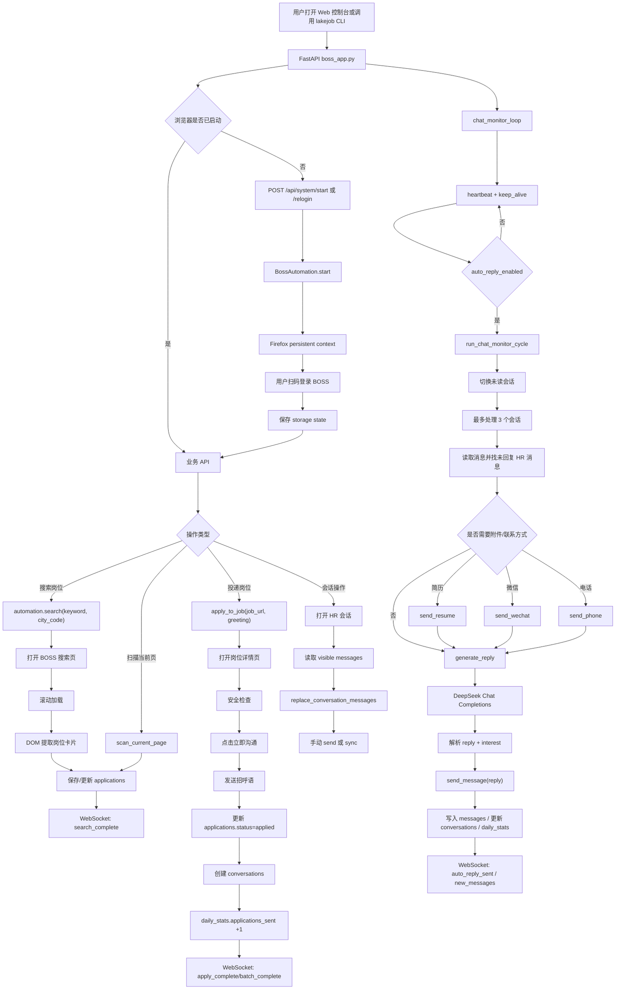
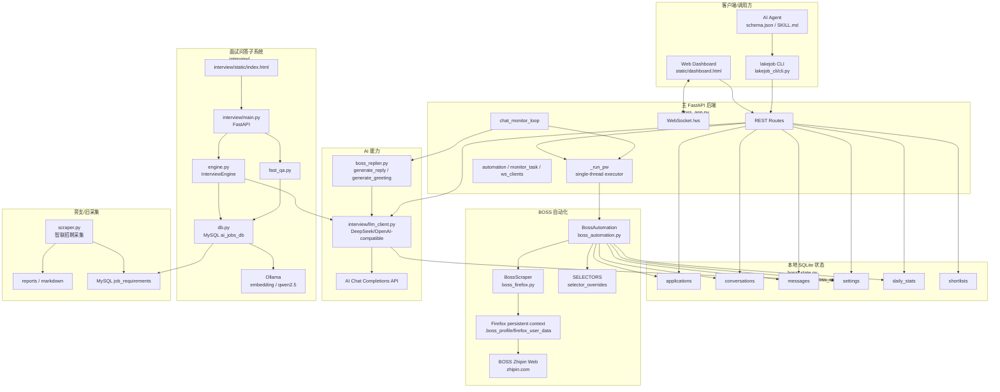

# LakeJob 项目架构分析

分析对象：`https://github.com/lake121380-source/lakejobai-job-radar`

分析方式：只读克隆并阅读现有源码。未修改项目代码，未新增功能，未运行自动化业务流程。

## 1. 项目目录树

```text
lakejobai-job-radar/
├── .github/
│   └── workflows/
│       └── ci.yml
├── interview/
│   ├── static/
│   │   └── index.html
│   ├── batch_seed.py
│   ├── benchmark.py
│   ├── db.py
│   ├── engine.py
│   ├── fast_qa.py
│   ├── llm_client.py
│   ├── main.py
│   ├── requirements.txt
│   ├── seed_data.py
│   └── start.sh
├── lakejob_cli/
│   ├── __init__.py
│   ├── cli.py
│   ├── client.py
│   ├── output.py
│   └── schema.json
├── static/
│   └── dashboard.html
├── .gitattributes
├── .gitignore
├── .pre-commit-config.yaml
├── boss_app.py
├── boss_automation.py
├── boss_firefox.py
├── boss_replier.py
├── boss_state.py
├── CHANGELOG.md
├── config.yaml
├── CONTRIBUTING.md
├── LICENSE
├── pyproject.toml
├── README.md
├── requirements.txt
├── scraper.py
├── SCRIPT.md
├── setup.sh
└── SKILL.md
```

文件长度事实：

| 文件 | 行数 |
|---|---:|
| `boss_automation.py` | 1245 |
| `boss_app.py` | 1056 |
| `boss_firefox.py` | 935 |
| `static/dashboard.html` | 522 |
| `boss_state.py` | 484 |
| `scraper.py` | 481 |
| `interview/fast_qa.py` | 574 |
| `interview/static/index.html` | 587 |

## 2. FastAPI 结构分析

项目中有两个 FastAPI 应用。

### 主应用：`boss_app.py`

`boss_app.py` 是 BOSS 直聘自动化控制台后端，创建 `FastAPI(title="BOSS直聘自动化控制台", version="1.0.0")`，挂载 `static/dashboard.html`，并提供 REST API、WebSocket 和后台聊天监控循环。

核心全局状态：

| 全局变量 | 作用 |
|---|---|
| `automation: Optional[BossAutomation]` | 当前 Playwright 自动化实例 |
| `monitor_task: Optional[asyncio.Task]` | 后台聊天监控任务 |
| `ws_clients: List[WebSocket]` | WebSocket 客户端列表 |
| `monitor_paused: bool` | 搜索/同步时暂停后台监控 |
| `browser_sync_lock: Optional[asyncio.Lock]` | 会话同步时保护浏览器操作 |
| `_playwright_executor` | 单线程执行器，保证 Playwright sync API 在同一线程运行 |

启动逻辑：

- `on_startup()` 初始化 `browser_sync_lock`，清理无效会话名，并合并同名活动会话。
- 如果 `automation` 已存在且 `page` 非空，则创建 `chat_monitor_loop()` 后台任务。
- `_run_pw(fn, *args)` 把同步 Playwright 操作投递到单线程 `ThreadPoolExecutor(max_workers=1)`。

请求模型：

| Pydantic 模型 | 字段 |
|---|---|
| `SearchRequest` | `keyword`, `city`, `welfare`, `limit` |
| `ApplyRequest` | `job_url`, `greeting` |
| `ApplyBatchRequest` | `job_urls`, `greeting` |
| `ScanAndApplyRequest` | `greeting` |
| `AnalyzeRequest` | `job_url`, `job_title`, `company`, `description` |
| `SendMessageRequest` | `content` |
| `SettingsUpdate` | 招呼语、AI风格、日投递上限、自动回复、延迟、简历摘要、微信、关键词、城市、选择器覆盖、AI配置 |

主要 API 分组：

| 分组 | 端点 |
|---|---|
| 页面 | `GET /` |
| 状态 | `GET /api/status`, `GET /api/stats`, `GET /api/doctor`, `GET /api/health` |
| 系统 | `POST /api/system/start`, `/stop`, `/relogin`, `/heartbeat`, `/navigate-chat` |
| 监控 | `POST /api/monitor/pause`, `/resume` |
| 调试 | `POST /api/debug/selector-test`, `GET /api/debug/page-stats`, `GET /api/debug/selectors-status` |
| 岗位 | `GET /api/jobs`, `POST /api/jobs/search`, `GET /api/jobs/{job_id}`, `POST /api/jobs/{job_id}/skip` |
| 投递 | `POST /api/jobs/apply`, `POST /api/jobs/apply-batch`, `POST /api/jobs/scan`, `POST /api/jobs/scan-and-apply` |
| AI分析 | `POST /api/jobs/analyze` |
| 候选池 | `GET /api/shortlists`, `POST /api/shortlists`, `DELETE /api/shortlists/{sid}` |
| 微信交换 | `GET /api/wechat-exchanges` |
| 会话 | `GET /api/conversations`, `GET /api/conversations/{conv_id}`, `GET /api/conversations/{conv_id}/messages` |
| 聊天操作 | `POST /api/conversations/{conv_id}/sync`, `/send`, `/open`, `/pause`, `/resume` |
| 设置 | `GET /api/settings`, `PUT /api/settings` |
| WebSocket | `WS /ws` |

后台监控：

- `chat_monitor_loop()` 启动后先 `keep_alive()`。
- 首轮立即调用 `automation.run_chat_monitor_cycle()`。
- 后续循环按设置中的 `min_reply_delay_sec` 和 `max_reply_delay_sec` 随机等待。
- 每轮执行 `heartbeat()`，连续失效会通过 WebSocket 广播 `session_expired`。
- 仅当 `settings.auto_reply_enabled == "true"` 时执行自动回复扫描。
- 监控过程中会广播 `new_messages`、`auto_reply_sent`、`wechat_exchanged`、`safety_warning` 等事件。

### 面试子应用：`interview/main.py`

`interview/main.py` 是独立的“面试问答 Agent”FastAPI 服务，创建 `FastAPI(title="面试问答Agent", version="1.0.0")`，提供学习问答、模拟面试、知识库搜索、面试回顾接口。

端点包括：

- `POST /api/interview/start`
- `POST /api/interview/next`
- `POST /api/interview/answer`
- `POST /api/interview/end`
- `POST /api/learn/ask`
- `GET /api/learn/search`
- `POST /api/learn/cache-clear`
- `GET /api/qa/search`
- `POST /api/qa/add`
- `GET /api/qa/categories`
- `GET /api/jobs/search`
- `GET /api/review/sessions`
- `GET /api/review/session/{session_id}`
- `GET /api/review/weak-areas`
- `POST /api/admin/refresh-embeddings`
- `GET /api/health`
- `GET /`

它与主 BOSS 控制台不共用同一个 FastAPI app。它依赖 `interview/db.py` 的 MySQL 数据库、`interview/llm_client.py` 的 Ollama/DeepSeek 调用。

## 3. Playwright 自动化流程分析

项目中有三处 Playwright 使用：

| 文件 | 用途 |
|---|---|
| `boss_firefox.py` | BOSS 直聘 Firefox 持久化浏览器、登录、搜索、岗位详情抽取 |
| `boss_automation.py` | 继承 `BossScraper`，增加投递、聊天、简历/微信/电话交换、自动回复监控 |
| `scraper.py` | 智联招聘采集脚本，使用 Chromium headless 抓取职位日报 |

### `BossScraper`：浏览器与搜索基础层

`boss_firefox.py` 定义 `BossScraper`。

关键状态：

- `PROFILE_DIR = .boss_profile/firefox_user_data`
- `STATE_FILE = .boss_profile/firefox_state.json`
- 使用 `sync_playwright().start()`
- 使用 `firefox.launch_persistent_context(...)`
- 注入 `ANTI_DETECT` 初始化脚本
- `page.set_default_timeout(30000)`

主要方法：

| 方法 | 作用 |
|---|---|
| `start()` | 启动 Firefox 持久化上下文，加载 cookies/state，注入反检测脚本 |
| `close()` | 关闭 browser context 和 Playwright |
| `_login_prompt_visible()` | 根据 URL、正文和 DOM 判断是否处于登录/扫码状态 |
| `is_logged_in_page()` | 判断当前页是否可视为已登录 |
| `login()` | 打开 BOSS 登录页，等待用户扫码，保存 storage state，并预热聊天页 |
| `search(keyword, city_code)` | 打开 BOSS 搜索页，滚动加载，提取岗位卡片 |
| `_filter_by_welfare(jobs, welfare_keywords)` | 对岗位福利做 AND 过滤 |
| `_extract_job_cards()` | 优先从 DOM 中提取岗位卡片 |
| `_scroll_all()` | 滚动页面直到高度稳定 |
| `_extract_links()` | 提取岗位详情链接 |
| `fetch_detail(url)` | 访问详情页，提取岗位描述和 HR 信息 |

搜索流程：

1. 拼接 `https://www.zhipin.com/web/geek/job?query=...&city=...`。
2. `page.goto(..., wait_until="load")`。
3. 随机等待并滚动加载。
4. 优先用 DOM 选择器抽取岗位卡片。
5. 若 DOM 抽取失败，回退到 body 文本行解析。
6. 补充岗位链接。
7. 返回 `title/salary/company/experience/education/city/url/description/hr_name/hr_title`。

### `BossAutomation`：交互自动化层

`boss_automation.py` 定义 `BossAutomation(BossScraper)`。

选择器集中在 `SELECTORS`，包括：

- `apply_button`
- `chat_input`
- `chat_send_button`
- `conversation_items`
- `message_items_in_chat`
- `unread_badge`
- `resume_attach_btn`
- `resume_confirm_btn`
- `wechat_share_btn`
- `phone_share_btn`
- `back_to_list`

`_merge_selectors()` 会从 SQLite `settings.selector_overrides` 读取 JSON 覆盖选择器。

核心方法：

| 方法 | 作用 |
|---|---|
| `_find_element()` / `_find_all_elements()` | 多选择器查找可见元素 |
| `_human_type()` / `_safe_click()` | 模拟输入与点击 |
| `_has_text()` | 检查页面正文是否包含文本 |
| `check_page_safety()` | 检查验证码、登录失效、风控等页面异常 |
| `check_logged_in()` / `heartbeat()` / `keep_alive()` | 登录与会话保活 |
| `apply_to_job()` | 打开岗位详情，点击立即沟通，发送招呼语，写入 SQLite |
| `apply_batch()` | 按随机延迟批量投递 |
| `navigate_to_chat()` | 打开 BOSS 聊天页 |
| `poll_conversation_list()` | 扫描侧边栏会话列表 |
| `read_visible_messages()` | 从当前聊天 DOM 读取消息 |
| `open_conversation_by_name()` | 根据 HR 名称打开会话 |
| `send_message()` | 在聊天输入框发送文本 |
| `_get_chat_security_id()` | 从页面数据中获取聊天 exchange securityId |
| `send_wechat()` | 调用 BOSS 交换联系方式接口或点击按钮 |
| `send_phone()` | 调用 BOSS 交换电话接口或点击按钮 |
| `send_resume()` | 点击发简历并确认 |
| `scan_current_page()` | 扫描当前 BOSS 搜索结果页 |
| `scan_and_apply_current_page()` | 扫描后批量投递 |
| `run_chat_monitor_cycle()` | 自动回复主循环的一轮执行 |

投递流程：

1. 检查 `job_url` 是否存在。
2. 读取 `daily_apply_limit`，并受 `MAX_APPLY_PER_DAY = 30` 限制。
3. 打开岗位详情页。
4. 执行 `check_page_safety()`。
5. 如果页面显示已沟通/继续沟通，则更新本地状态为 `applied`。
6. 查找“立即沟通”按钮并点击。
7. 检查 BOSS 今日沟通次数是否用完。
8. 找聊天输入框。
9. 使用传入 greeting 或 `settings.greeting_template` 发送招呼语。
10. 写入或更新 `applications`。
11. 从页面提取 HR 名、公司、职位。
12. 如果 HR 名有效，创建 `conversations`。
13. 增加 `daily_stats.applications_sent`。

聊天自动回复流程：

1. 保证当前在 `/web/geek/chat`。
2. 优先切换到未读 tab。
3. 执行安全检查。
4. `poll_conversation_list()` 获取未读会话。
5. 最多处理前 3 个未读会话。
6. 匹配本地已知会话；否则根据列表文本创建新会话。
7. 打开对应 HR 会话。
8. `read_visible_messages()` 读取 DOM 中可见消息。
9. `replace_conversation_messages()` 覆盖本地消息缓存。
10. 从 HR 消息里提取微信号并写入 `conversations.hr_wechat`。
11. 找到最后一条未被我方回复的 HR 消息。
12. 如果全局自动回复开启且未超 `MAX_AUTO_REPLY_PER_DAY = 200`，调用 `boss_replier.generate_reply()`。
13. 若 HR 消息触发简历/微信/电话关键词，先执行 `send_resume()` / `send_wechat()` / `send_phone()`。
14. 再发送 AI 回复。
15. 写入 `messages`，更新 `conversations`，增加 `daily_stats.auto_replies_sent`。
16. 根据 AI 返回的 `interest` 更新 `conversations.interest_level`。

## 4. SQLite 数据库结构分析

主项目 SQLite 仅在 `boss_state.py` 中定义。数据库路径：

```text
.boss_profile/boss_state.db
```

连接设置：

- `sqlite3.connect(..., check_same_thread=False)`
- `row_factory = sqlite3.Row`
- `PRAGMA journal_mode=WAL`
- `PRAGMA foreign_keys=ON`
- 使用 `threading.local()` 保存线程本地连接。

### 表：`applications`

用途：保存岗位与投递状态。

| 字段 | 类型 | 说明 |
|---|---|---|
| `id` | INTEGER PK | 自增主键 |
| `job_title` | TEXT NOT NULL | 岗位名称 |
| `company` | TEXT | 公司 |
| `salary` | TEXT | 薪资 |
| `job_url` | TEXT UNIQUE NOT NULL | 岗位 URL |
| `city` | TEXT | 城市 |
| `experience` | TEXT | 经验 |
| `education` | TEXT | 学历 |
| `hr_name` | TEXT | HR 名称 |
| `hr_title` | TEXT | HR 职位 |
| `description` | TEXT | JD |
| `status` | TEXT DEFAULT `pending` | 状态 |
| `greeting_text` | TEXT | 招呼语 |
| `greeting_sent_at` | TIMESTAMP | 招呼发送时间 |
| `created_at` | TIMESTAMP | 创建时间 |
| `updated_at` | TIMESTAMP | 更新时间 |

相关函数：`add_application`、`get_application`、`get_application_by_url`、`update_application_from_job`、`list_applications`、`update_application_status`、`get_pending_applications`。

### 表：`conversations`

用途：保存 HR 会话状态。

| 字段 | 类型 | 说明 |
|---|---|---|
| `id` | INTEGER PK | 自增主键 |
| `application_id` | INTEGER FK | 关联 `applications.id` |
| `hr_name` | TEXT NOT NULL | HR 名 |
| `hr_company` | TEXT | HR 公司 |
| `job_title` | TEXT | 岗位 |
| `last_message_text` | TEXT | 最后一条消息 |
| `last_message_from` | TEXT | 最后一条消息来源 |
| `last_message_at` | TIMESTAMP | 最后消息时间 |
| `unread_count` | INTEGER DEFAULT 0 | 未读数 |
| `status` | TEXT DEFAULT `active` | 会话状态 |
| `auto_reply_enabled` | INTEGER DEFAULT 1 | 单会话自动回复开关 |
| `interest_level` | TEXT | AI 判断的 HR 兴趣度 |
| `hr_wechat` | TEXT | HR 微信号 |
| `wechat_shared_at` | TIMESTAMP | 微信交换时间 |
| `resume_sent` | INTEGER DEFAULT 0 | 是否已发简历 |
| `phone_shared` | INTEGER DEFAULT 0 | 是否已交换电话 |
| `created_at` | TIMESTAMP | 创建时间 |
| `updated_at` | TIMESTAMP | 更新时间 |

相关函数：`get_or_create_conversation`、`list_active_conversations`、`find_conversation_by_hr_name`、`update_conversation_last_message`、`update_conversation_status`、`update_conversation_interest`、`update_conversation_wechat`、`mark_resume_sent`、`mark_phone_shared`、`set_auto_reply`。

### 表：`messages`

用途：保存聊天消息。

| 字段 | 类型 | 说明 |
|---|---|---|
| `id` | INTEGER PK | 自增主键 |
| `conversation_id` | INTEGER FK NOT NULL | 关联 `conversations.id` |
| `sender` | TEXT NOT NULL | `hr` 或 `me` |
| `content` | TEXT NOT NULL | 消息内容 |
| `delivery_status` | TEXT | 发送状态 |
| `ai_generated` | INTEGER DEFAULT 0 | 是否 AI 生成 |
| `created_at` | TIMESTAMP | 创建时间 |

相关函数：`add_message`、`get_messages`、`get_recent_messages`、`replace_conversation_messages`、`get_last_hr_message`、`message_exists`。

### 表：`settings`

用途：保存运行配置。

| 字段 | 类型 | 说明 |
|---|---|---|
| `key` | TEXT PK | 配置名 |
| `value` | TEXT NOT NULL | 配置值 |
| `updated_at` | TIMESTAMP | 更新时间 |

默认配置包括：

- `greeting_template`
- `greeting_enabled`
- `ai_reply_style`
- `daily_apply_limit`
- `auto_reply_enabled`
- `min_reply_delay_sec`
- `max_reply_delay_sec`
- `batch_delay_min_sec`
- `batch_delay_max_sec`
- `resume_summary`
- `wechat_id`
- `search_keywords`
- `default_city`

运行时还会使用：

- `selector_overrides`
- `ai_api_key`
- `ai_base_url`
- `ai_model`

### 表：`daily_stats`

用途：记录每日统计。

| 字段 | 类型 | 说明 |
|---|---|---|
| `date` | TEXT PK | 日期 |
| `applications_sent` | INTEGER DEFAULT 0 | 投递数 |
| `messages_sent` | INTEGER DEFAULT 0 | 发送消息数 |
| `messages_received` | INTEGER DEFAULT 0 | 接收消息数 |
| `auto_replies_sent` | INTEGER DEFAULT 0 | AI 自动回复数 |

### 表：`shortlists`

用途：本地候选池。

| 字段 | 类型 | 说明 |
|---|---|---|
| `id` | INTEGER PK | 自增主键 |
| `job_url` | TEXT UNIQUE NOT NULL | 岗位 URL |
| `job_title` | TEXT NOT NULL | 岗位标题 |
| `company` | TEXT | 公司 |
| `salary` | TEXT | 薪资 |
| `city` | TEXT | 城市 |
| `note` | TEXT | 备注 |
| `created_at` | TIMESTAMP | 创建时间 |

注意：`interview/db.py` 使用 MySQL，不属于主项目 SQLite 结构。

## 5. CLI 命令结构分析

CLI 包在 `lakejob_cli/`，入口由 `pyproject.toml` 注册：

```toml
[project.scripts]
lakejob = "lakejob_cli.cli:main"
```

组成：

| 文件 | 作用 |
|---|---|
| `cli.py` | Click 命令定义 |
| `client.py` | 调用 FastAPI 后端的 HTTP 客户端 |
| `output.py` | 统一 JSON envelope 输出 |
| `schema.json` | Agent 工具描述 |

输出协议：

```json
{
  "ok": true,
  "command": "search",
  "data": {},
  "error": null
}
```

`output.ok_or_fail()` 把 HTTP 错误转成 `ok=false`。

CLI 命令：

| 命令 | 调用 |
|---|---|
| `lakejob version` | 本地输出版本 |
| `lakejob schema` | 读取 `schema.json` |
| `lakejob search <keyword>` | `POST /api/jobs/search` |
| `lakejob status` | `GET /api/status` |
| `lakejob stats` | `GET /api/stats` |
| `lakejob jobs` | `GET /api/jobs` |
| `lakejob apply <job_url>` | `POST /api/jobs/apply` |
| `lakejob apply-batch` | 先 `GET /api/jobs`，再 `POST /api/jobs/apply-batch` |
| `lakejob scan` | `POST /api/jobs/scan` |
| `lakejob scan-apply` | `POST /api/jobs/scan-and-apply` |
| `lakejob conversations` | `GET /api/conversations` |
| `lakejob chat <conv_id>` | `GET /api/conversations/{conv_id}/messages` |
| `lakejob send <conv_id> --msg ...` | `POST /api/conversations/{conv_id}/send` |
| `lakejob doctor` | `GET /api/doctor` |
| `lakejob login` | `POST /api/system/relogin` |
| `lakejob analyze <job_url>` | `POST /api/jobs/analyze` |
| `lakejob shortlist list/add/remove` | `GET/POST/DELETE /api/shortlists` |
| `lakejob server --start/--stop` | 启停 `boss_app.py` 或查询状态 |

结构事实：

- `cli.py` 使用 Click。
- `client.py` 使用 `httpx`。
- 默认 API 地址来自 `LAKEJOB_API`，否则为 `http://127.0.0.1:8010`。
- `server --start` 用 `subprocess.Popen(["python", boss_app.py, "--port", ...])` 启动服务。
- `server --stop` 在 Windows 上执行 `taskkill /F /IM python.exe`，在非 Windows 上执行 `pkill -f boss_app.py`。

发现的不一致：

- `cli.py` 实现了 `analyze` 和 `shortlist`。
- `schema.json` 中列出的命令没有包含 `analyze` 和 `shortlist`。

## 6. AI 回复逻辑分析

AI 回复主文件是 `boss_replier.py`，它复用 `interview/llm_client.py` 中的 `llm_chat_deepseek()`。

### 配置来源

`interview/llm_client.py` 的 `_load_ai_config()` 从主项目 SQLite `settings` 读取：

- `ai_api_key`
- `ai_base_url`
- `ai_model`

默认值：

- `base_url = https://api.deepseek.com`
- `model = deepseek-chat`

调用接口：

```text
POST {base_url}/chat/completions
Authorization: Bearer {ai_api_key}
```

### 回复生成入口

`generate_reply(conversation_id, hr_message, job_info, style, resume_summary, wechat_id)` 返回：

```python
(reply_text, interest_level)
```

流程：

1. 空消息直接返回 `("", "")`。
2. 对简单问候语做本地规则回复，不调用 LLM，并返回 `interest="low"`。
3. 调用 `build_reply_context()` 组装上下文。
4. 根据 `style` 加入回复风格：
   - `professional`
   - `casual`
   - `enthusiastic`
5. 发送 system prompt + user context 到 DeepSeek。
6. 期望模型输出严格 JSON：

```json
{
  "reply": "...",
  "interest": "high"
}
```

7. 先尝试 `json.loads`，失败时用正则提取 `"reply"` 和 `"interest"`。
8. `interest` 只接受 `high/medium/low`。
9. 回复超过 300 字会截断。
10. 命中拒答模式时返回空。

### 上下文内容

`build_reply_context()` 包含：

- 招聘方公司
- 应聘岗位
- 岗位描述前 500 字
- 简历摘要
- 微信号及编码提示
- 最近 5 条消息
- HR 当前消息
- JSON 输出格式要求

### 业务规则

system prompt 中明确包含：

- AI 要坦诚说明自己是求职者开发的 AI 助手。
- 回复 2-4 句话。
- 回复要围绕岗位名称、公司和 JD。
- 不直接答应面试时间，遇到面试邀请时引导加微信。
- HR 要简历时，系统会先通过 BOSS 官方按钮发简历，AI 只需说明已通过 BOSS 发出。
- HR 要微信时，系统会先通过 BOSS 官方按钮交换微信，AI 回复里避免直接出现微信号等敏感词。
- HR 要电话时，系统会先通过 BOSS 官方按钮交换电话。
- 输出兴趣度 `high/medium/low`。

### 招呼语

`generate_greeting(job_title, company, template, style)` 从 `settings.greeting_template` 读取模板，替换 `{job_title}` 和 `{company}`。

### JD 分析

`boss_app.py` 的 `POST /api/jobs/analyze` 直接构造 prompt 调用 `llm_chat_deepseek()`，返回 JSON：

- `match_score`
- `key_skills`
- `gap`
- `advice`
- `summary`

若配置了 `resume_summary`，prompt 会对比简历；否则只分析 JD。

## 7. Boss 直聘自动化流程图



## 8. 已实现功能清单

基于源码可确认已实现：

| 功能 | 证据模块 |
|---|---|
| Web 控制台后端 | `boss_app.py` |
| 单文件 Web 前端 | `static/dashboard.html` |
| WebSocket 实时广播 | `boss_app.py` |
| BOSS Firefox 持久化浏览器启动 | `boss_firefox.py` |
| BOSS 扫码登录等待与 storage state 保存 | `boss_firefox.py` |
| BOSS 岗位搜索 | `boss_firefox.py` |
| 搜索结果滚动加载 | `boss_firefox.py` |
| 岗位卡片 DOM 抽取 | `boss_firefox.py` |
| 文本解析回退抽取 | `boss_firefox.py` |
| 福利关键词过滤 | `boss_firefox.py` |
| 岗位详情 JD/HR 信息抽取 | `boss_firefox.py` |
| 单岗位投递 | `boss_automation.py` |
| 批量投递 | `boss_automation.py` |
| 当前页扫描 | `boss_automation.py` |
| 扫描并投递 | `boss_automation.py` |
| 投递日上限 | `boss_automation.py`, `boss_app.py`, `boss_state.py` |
| 招呼语模板 | `boss_replier.py`, `boss_state.py` |
| SQLite 本地状态持久化 | `boss_state.py` |
| 岗位列表/状态管理 | `boss_state.py`, `boss_app.py` |
| 候选池 shortlists | `boss_state.py`, `boss_app.py`, `lakejob_cli/cli.py` |
| 会话列表读取 | `boss_automation.py` |
| 聊天消息 DOM 读取 | `boss_automation.py` |
| 本地聊天消息缓存 | `boss_state.py` |
| 手动发送消息 | `boss_app.py`, `boss_automation.py` |
| 自动回复后台监控 | `boss_app.py`, `boss_automation.py` |
| AI 生成 HR 回复 | `boss_replier.py` |
| HR 兴趣度判断 | `boss_replier.py`, `boss_state.py` |
| 自动发简历 | `boss_automation.py` |
| 自动交换微信 | `boss_automation.py` |
| 自动交换电话 | `boss_automation.py` |
| 从 HR 消息提取微信号 | `boss_automation.py` |
| JD AI 分析 | `boss_app.py` |
| 设置读写 | `boss_app.py`, `boss_state.py` |
| 选择器覆盖配置 | `boss_automation.py`, `boss_app.py` |
| CLI JSON envelope | `lakejob_cli/output.py` |
| CLI HTTP 客户端 | `lakejob_cli/client.py` |
| CLI 命令集 | `lakejob_cli/cli.py` |
| Agent schema 输出 | `lakejob_cli/schema.json` |
| 诊断 doctor | `boss_app.py`, `lakejob_cli/cli.py` |
| 面试问答 FastAPI 子系统 | `interview/main.py` |
| 面试出题/批改引擎 | `interview/engine.py` |
| 面试知识库语义搜索 | `interview/db.py`, `interview/fast_qa.py` |
| 智联招聘旧采集脚本 | `scraper.py` |
| GitHub Actions CI 配置 | `.github/workflows/ci.yml` |

## 9. 未实现功能清单

源码中未发现 `TODO`、`FIXME`、`raise NotImplemented` 或明确“未实现”标记。

但存在以下“已出现声明或结构，但实现闭环不完整/不一致”的项目：

| 项目 | 证据 |
|---|---|
| CLI schema 未覆盖全部 CLI 命令 | `cli.py` 有 `analyze`、`shortlist`，`schema.json` 未列出这两个命令 |
| `search` CLI 的 `--welfare` 参数未传入 HTTP 客户端 | `cli.py` 构造了含 `welfare` 的 `payload`，但实际调用 `client.search(keyword, city, count)`；`client.search()` 只发送 `keyword/city/limit` |
| README/SKILL 中仍引用旧 owner | README/SKILL 安装命令仍写 `longnull-ck/lakejobai-job-radar` |
| `pyproject.toml` 测试目录指向 `tests`，仓库中没有 `tests/` | `tool.pytest.ini_options.testpaths = ["tests"]`，目录树无 `tests` |
| 主应用和 interview 子应用数据库体系未统一 | 主应用 SQLite，`interview/db.py` 使用 MySQL |
| `interview/db.py` 存在硬编码 MySQL 连接配置 | `DB_CONFIG` 内含固定 host/user/password/database |

以上不是功能猜测，均来自现有文件之间的可验证不一致。

## 10. 可以直接作为 LakeJob Core 基础模块的模块

以下模块已经形成相对清晰的基础能力，可作为 LakeJob Core 的基础素材：

| 模块 | 可作为基础的部分 | 原因 |
|---|---|---|
| `boss_state.py` | SQLite 表结构、settings、applications、conversations、messages、daily_stats、shortlists 的数据访问函数 | 已经承载主业务状态，并被 FastAPI、自动化、AI 回复共同依赖 |
| `lakejob_cli/output.py` | JSON envelope 输出协议 | 简单、独立、Agent 友好 |
| `lakejob_cli/client.py` | HTTP API 客户端封装 | 结构清楚，和 CLI 命令解耦 |
| `lakejob_cli/cli.py` | CLI 命令入口骨架 | 已覆盖主业务操作，适合作为 Agent 调用入口基础 |
| `boss_replier.py` | HR 回复上下文构建、回复生成、兴趣度解析 | 已独立封装 AI 回复核心逻辑 |
| `interview/llm_client.py` 中的 DeepSeek/OpenAI-compatible 调用 | AI API 配置读取和 Chat Completions 调用 | 主回复逻辑已经复用该模块 |
| `boss_firefox.py` 中的 `BossScraper.start/login/search/fetch_detail` | BOSS 浏览器启动、登录、搜索、详情抽取基础能力 | 它是自动化流程的父类和基础层 |
| `boss_automation.py` 中的选择器配置结构 | `SELECTORS` 与 `selector_overrides` | 已支持 BOSS UI 变化时通过配置覆盖 |
| `SKILL.md` / `lakejob_cli/schema.json` | Agent 集成说明和工具 schema 素材 | 已经表达了 Agent 调用协议 |

## 11. 未来必须重构的模块

以下结论基于现有代码事实和本次用户给定的全局规则，尤其是“最大文件长度 300 行、最大函数长度 50 行、无重复逻辑、生产可用”。

| 模块 | 必须重构的原因 |
|---|---|
| `boss_automation.py` | 1245 行，远超 300 行；同时包含选择器、底层交互、投递、会话读取、联系方式交换、自动回复监控等多个职责 |
| `boss_app.py` | 1056 行，远超 300 行；同时包含 FastAPI app、路由、状态管理、Playwright 线程桥、WebSocket、后台循环、AI JD 分析 |
| `boss_firefox.py` | 935 行，远超 300 行；同时包含城市表、反检测脚本、浏览器生命周期、登录、搜索、DOM 抽取、详情抽取、报表能力 |
| `boss_state.py` | 484 行，远超 300 行；数据模型、迁移、默认配置、所有 DAO 混在一个文件 |
| `scraper.py` | 481 行；是智联招聘日报采集脚本，与主 BOSS 自动化体系不同，且包含 MySQL shell 写入路径 |
| `static/dashboard.html` | 522 行；单文件前端包含 HTML/CSS/JS，超过 300 行 |
| `interview/fast_qa.py` | 574 行；问答缓存、分类、全文检索、语义检索、fallback LLM 混在一个模块 |
| `interview/static/index.html` | 587 行；面试子系统前端单文件过大 |
| `interview/db.py` | 使用 MySQL，且存在硬编码连接信息；与主应用 SQLite 状态层割裂 |
| `lakejob_cli/schema.json` | 与 `cli.py` 命令集不一致，缺少 `analyze` 和 `shortlist` |
| `lakejob_cli/cli.py` | `search --welfare` 参数没有实际传入 client；`server --stop` 的实现会按进程名杀 Python 进程 |
| AI 配置链路 | `boss_replier.py` 通过修改 `sys.path` 复用 `interview/llm_client.py`，模块边界不清晰 |
| 主应用全局状态 | `automation`、`monitor_task`、`ws_clients` 等全局变量集中在 `boss_app.py`，多职责耦合 |
| Playwright 同步执行桥 | 所有浏览器动作进入单线程 executor，结构上可运行，但应用服务层和浏览器执行层耦合在同一文件 |

## 完整 Mermaid 架构图


