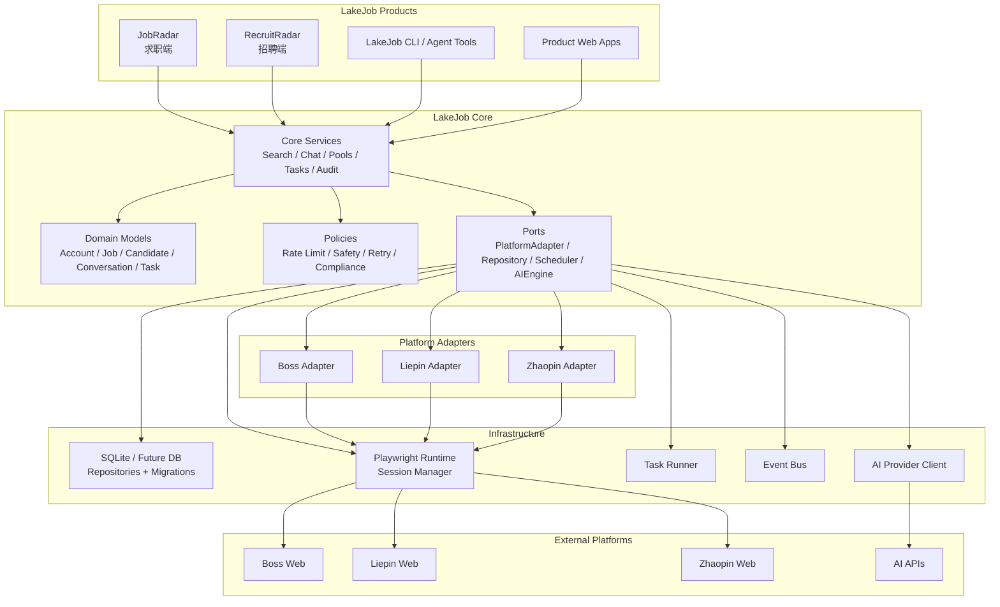
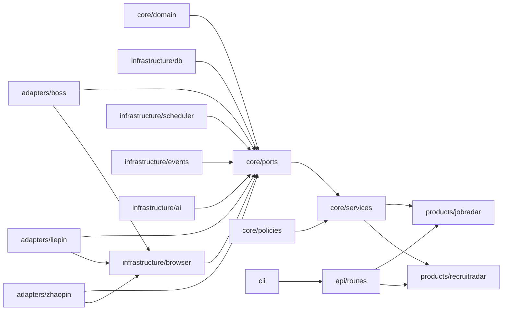
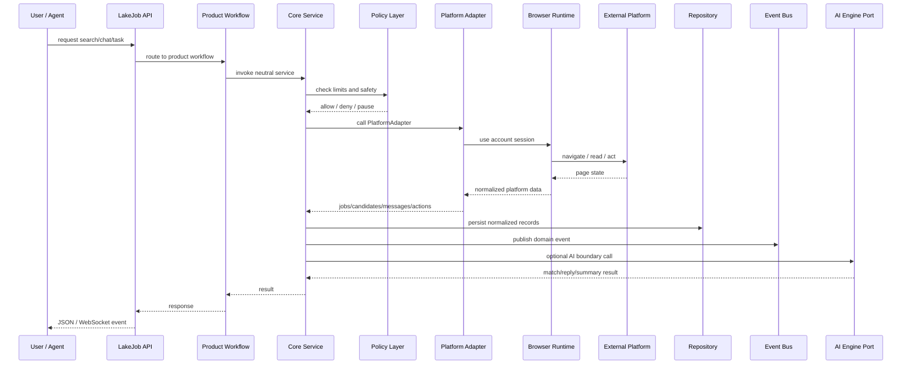

# LakeJob Core Architecture

目标：把当前 `lakejobai-job-radar` 从单一 BOSS 求职自动化项目，升级为未来 LakeJob Ecosystem 的共享底座 LakeJob Core。

约束：

- 本阶段只做架构设计。
- 不新增业务功能。
- 不开发求职功能。
- 不开发招聘功能。
- 不开发 AI 功能。
- 不修改现有源码。

未来需要支持：

1. JobRadar：求职端
2. RecruitRadar：招聘端
3. 多平台：Boss、猎聘、智联
4. 多账号
5. AI 匹配引擎
6. 候选池
7. 岗位池
8. 自动聊天
9. 自动搜索
10. 定时任务

## Core 定位

LakeJob Core 不应该属于 JobRadar 或 RecruitRadar 任一产品。它应成为共享引擎，负责：

- 统一领域模型。
- 统一账号、平台、会话、岗位、候选人、消息、任务、事件的数据结构。
- 统一平台适配器接口。
- 统一自动化执行生命周期。
- 统一调度、审计、限流、安全停止。
- 统一 AI 能力调用边界，但不把具体求职/招聘 prompt 固化在 Core 内。
- 为 JobRadar、RecruitRadar、CLI、Web API 和未来 Agent 工具提供稳定接口。

Core 不负责：

- 具体产品页面。
- 具体求职话术。
- 具体招聘话术。
- 具体 AI 匹配策略。
- 单个平台的 DOM 细节。
- 单账号浏览器状态直接暴露给业务层。

## 新目录结构

```text
lakejob/
├── pyproject.toml
├── README.md
├── docs/
│   ├── LakeJob-Analysis.md
│   ├── LakeJob-Core-Architecture.md
│   ├── adapters.md
│   ├── data-model.md
│   └── api-contract.md
├── src/
│   └── lakejob/
│       ├── __init__.py
│       ├── core/
│       │   ├── __init__.py
│       │   ├── domain/
│       │   │   ├── __init__.py
│       │   │   ├── account.py
│       │   │   ├── candidate.py
│       │   │   ├── conversation.py
│       │   │   ├── job.py
│       │   │   ├── message.py
│       │   │   ├── platform.py
│       │   │   ├── pool.py
│       │   │   ├── task.py
│       │   │   └── event.py
│       │   ├── ports/
│       │   │   ├── __init__.py
│       │   │   ├── platform_adapter.py
│       │   │   ├── browser_session.py
│       │   │   ├── repository.py
│       │   │   ├── scheduler.py
│       │   │   ├── ai_engine.py
│       │   │   └── event_bus.py
│       │   ├── services/
│       │   │   ├── __init__.py
│       │   │   ├── account_service.py
│       │   │   ├── job_pool_service.py
│       │   │   ├── candidate_pool_service.py
│       │   │   ├── conversation_service.py
│       │   │   ├── search_service.py
│       │   │   ├── chat_service.py
│       │   │   ├── automation_service.py
│       │   │   ├── task_service.py
│       │   │   └── audit_service.py
│       │   ├── policies/
│       │   │   ├── __init__.py
│       │   │   ├── rate_limit.py
│       │   │   ├── safety.py
│       │   │   ├── retry.py
│       │   │   └── compliance.py
│       │   └── errors.py
│       ├── infrastructure/
│       │   ├── __init__.py
│       │   ├── db/
│       │   │   ├── __init__.py
│       │   │   ├── sqlite.py
│       │   │   ├── migrations/
│       │   │   └── repositories/
│       │   │       ├── account_repository.py
│       │   │       ├── job_repository.py
│       │   │       ├── candidate_repository.py
│       │   │       ├── conversation_repository.py
│       │   │       ├── message_repository.py
│       │   │       ├── task_repository.py
│       │   │       └── settings_repository.py
│       │   ├── browser/
│       │   │   ├── __init__.py
│       │   │   ├── playwright_runtime.py
│       │   │   ├── session_manager.py
│       │   │   └── profile_store.py
│       │   ├── scheduler/
│       │   │   ├── __init__.py
│       │   │   └── task_runner.py
│       │   ├── events/
│       │   │   ├── __init__.py
│       │   │   └── in_memory_bus.py
│       │   └── ai/
│       │       ├── __init__.py
│       │       ├── openai_compatible.py
│       │       └── prompt_registry.py
│       ├── adapters/
│       │   ├── __init__.py
│       │   ├── boss/
│       │   │   ├── __init__.py
│       │   │   ├── adapter.py
│       │   │   ├── browser.py
│       │   │   ├── selectors.py
│       │   │   ├── parsers.py
│       │   │   ├── search.py
│       │   │   ├── chat.py
│       │   │   └── actions.py
│       │   ├── liepin/
│       │   │   ├── __init__.py
│       │   │   └── adapter.py
│       │   └── zhaopin/
│       │       ├── __init__.py
│       │       └── adapter.py
│       ├── products/
│       │   ├── __init__.py
│       │   ├── jobradar/
│       │   │   ├── __init__.py
│       │   │   ├── api.py
│       │   │   ├── workflows.py
│       │   │   └── schemas.py
│       │   └── recruitradar/
│       │       ├── __init__.py
│       │       ├── api.py
│       │       ├── workflows.py
│       │       └── schemas.py
│       ├── api/
│       │   ├── __init__.py
│       │   ├── app.py
│       │   ├── dependencies.py
│       │   ├── routes/
│       │   │   ├── accounts.py
│       │   │   ├── platforms.py
│       │   │   ├── jobs.py
│       │   │   ├── candidates.py
│       │   │   ├── conversations.py
│       │   │   ├── tasks.py
│       │   │   ├── settings.py
│       │   │   └── health.py
│       │   └── ws.py
│       └── cli/
│           ├── __init__.py
│           ├── main.py
│           ├── client.py
│           ├── output.py
│           └── schema.json
├── apps/
│   ├── jobradar-web/
│   └── recruitradar-web/
├── legacy/
│   ├── lakejobai-job-radar/
│   └── notes.md
└── tests/
    ├── unit/
    ├── integration/
    └── contract/
```

## 模块边界划分

### `core/domain`

定义稳定业务实体，不依赖 FastAPI、Playwright、SQLite、AI SDK。

核心实体：

| 实体 | 说明 |
|---|---|
| `Platform` | Boss、猎聘、智联等平台定义 |
| `Account` | 平台账号，支持多账号 |
| `BrowserSession` | 账号对应浏览器会话状态 |
| `Job` | 岗位标准模型 |
| `Candidate` | 候选人标准模型 |
| `Conversation` | 平台会话标准模型 |
| `Message` | 聊天消息标准模型 |
| `JobPool` | 岗位池 |
| `CandidatePool` | 候选池 |
| `AutomationTask` | 自动搜索、自动聊天、同步等任务 |
| `DomainEvent` | 搜索完成、消息收到、任务失败等事件 |

边界规则：

- 不出现 `Boss` 专有 DOM 选择器。
- 不出现 Playwright 类型。
- 不出现 HTTP request/response。
- 不出现 AI prompt。
- 不出现 SQLite SQL。

### `core/ports`

定义 Core 依赖的接口。

| Port | 说明 |
|---|---|
| `PlatformAdapter` | 平台适配器统一接口 |
| `BrowserSessionPort` | 浏览器生命周期接口 |
| `RepositoryPort` | 数据访问接口 |
| `SchedulerPort` | 定时任务接口 |
| `AIEnginePort` | AI 匹配/回复/摘要接口边界 |
| `EventBusPort` | 事件发布订阅接口 |

`PlatformAdapter` 应覆盖未来能力，但当前只设计接口：

```text
login(account)
check_session(account)
search_jobs(account, query)
search_candidates(account, query)
fetch_job_detail(account, platform_job_id)
fetch_candidate_detail(account, platform_candidate_id)
list_conversations(account)
fetch_messages(account, conversation)
send_message(account, conversation, message)
perform_action(account, action)
```

### `core/services`

编排领域逻辑，不关心具体平台实现。

| Service | 职责 |
|---|---|
| `AccountService` | 多账号注册、状态、会话绑定 |
| `JobPoolService` | 岗位入池、去重、状态流转 |
| `CandidatePoolService` | 候选人入池、去重、状态流转 |
| `ConversationService` | 会话与消息标准化 |
| `SearchService` | 搜索任务编排 |
| `ChatService` | 聊天任务编排 |
| `AutomationService` | 自动化执行生命周期 |
| `TaskService` | 任务创建、暂停、恢复、失败记录 |
| `AuditService` | 操作审计与安全停止记录 |

### `core/policies`

规则独立出来，避免散落在自动化和 API 中。

| Policy | 说明 |
|---|---|
| `rate_limit.py` | 每日上限、每账号上限、平台限流 |
| `safety.py` | 登录失效、验证码、风控、安全停止 |
| `retry.py` | 重试策略 |
| `compliance.py` | 合规边界与敏感动作约束 |

### `infrastructure`

技术实现层。

| 目录 | 职责 |
|---|---|
| `db/` | SQLite 连接、迁移、Repository 实现 |
| `browser/` | Playwright runtime、profile 管理、多账号 session |
| `scheduler/` | 定时任务执行器 |
| `events/` | 事件总线实现 |
| `ai/` | OpenAI-compatible 客户端、prompt 注册表 |

### `adapters`

平台适配层。所有平台差异都应收敛到这里。

| 平台 | 模块 |
|---|---|
| Boss | `adapters/boss/` |
| 猎聘 | `adapters/liepin/` |
| 智联 | `adapters/zhaopin/` |

Boss 适配器内部边界：

| 文件 | 说明 |
|---|---|
| `browser.py` | Boss 浏览器启动、登录、保活 |
| `selectors.py` | Boss 选择器 |
| `parsers.py` | DOM/文本解析 |
| `search.py` | 搜索和详情抽取 |
| `chat.py` | 会话和消息读取 |
| `actions.py` | 发送消息、交换联系方式、发简历等平台动作 |
| `adapter.py` | 实现 `PlatformAdapter` |

### `products`

产品层只组合 Core，不承载底层自动化。

| 产品 | 说明 |
|---|---|
| `products/jobradar` | 求职端工作流：岗位搜索、岗位池、投递、求职会话 |
| `products/recruitradar` | 招聘端工作流：候选搜索、候选池、邀约、招聘会话 |

### `api`

统一 API 网关。

建议所有产品 API 通过依赖注入调用 Core service。FastAPI routes 不直接调用 Playwright，也不直接写 SQLite。

### `cli`

保留 Agent 友好的 JSON envelope，但命令应调用统一 API 或 Core service，不绑定 Boss 单平台。

## 哪些代码直接保留

以下代码可保留为 Core 资产或迁移后的基础实现，不需要改变其核心思想：

| 当前代码 | 保留内容 | 目标位置 |
|---|---|---|
| `lakejob_cli/output.py` | JSON envelope 协议 | `src/lakejob/cli/output.py` |
| `lakejob_cli/client.py` | HTTP client 结构 | `src/lakejob/cli/client.py` |
| `lakejob_cli/schema.json` | Agent schema 素材 | `src/lakejob/cli/schema.json` |
| `boss_state.py` | SQLite 表和 DAO 的领域素材 | `infrastructure/db/repositories/` |
| `boss_replier.py` | 回复上下文和 JSON 解析经验 | `products/jobradar/workflows.py` 或 AI prompt registry |
| `interview/llm_client.py` | OpenAI-compatible 调用方式 | `infrastructure/ai/openai_compatible.py` |
| `boss_firefox.py` | Firefox persistent context、登录、搜索、详情抽取经验 | `adapters/boss/browser.py`, `search.py`, `parsers.py` |
| `boss_automation.py` | 多选择器策略、投递、聊天、发简历/微信/电话动作经验 | `adapters/boss/actions.py`, `chat.py`, `selectors.py` |
| `static/dashboard.html` | 当前 JobRadar 控制台参考界面 | `apps/jobradar-web/` 参考资产 |

“直接保留”指保留协议、结构和已验证能力，不表示原文件原封不动进入 Core。

## 哪些代码迁移

| 当前代码 | 迁移方向 |
|---|---|
| `boss_app.py` 的 API 路由 | 拆到 `api/routes/` 和 `products/jobradar/api.py` |
| `boss_app.py` 的 `_run_pw` 和 executor | 迁移到 `infrastructure/browser/playwright_runtime.py` |
| `boss_app.py` 的 `chat_monitor_loop` | 迁移到 `core/services/task_service.py` + `core/services/chat_service.py` |
| `boss_app.py` 的 WebSocket broadcast | 迁移到 `infrastructure/events/` 和 `api/ws.py` |
| `boss_state.py` 建表脚本 | 迁移到 `infrastructure/db/migrations/` |
| `boss_state.py` settings 函数 | 迁移到 `settings_repository.py` |
| `boss_state.py` applications 函数 | 迁移到 `job_repository.py` |
| `boss_state.py` conversations/messages 函数 | 迁移到 `conversation_repository.py` 和 `message_repository.py` |
| `boss_state.py` shortlists 函数 | 迁移为 `job_pool_repository.py`，并为候选池建立对称结构 |
| `boss_firefox.py` 城市表 | 迁移到 `adapters/boss/platform_config.py` |
| `boss_firefox.py` `ANTI_DETECT` | 迁移到 `adapters/boss/browser.py` 或 profile 策略 |
| `boss_firefox.py` `BossScraper` | 拆成 browser/search/parsers |
| `boss_automation.py` `SELECTORS` | 迁移到 `adapters/boss/selectors.py` |
| `boss_automation.py` `_find_element` 等底层 helpers | 迁移到 `infrastructure/browser/` 或 `adapters/boss/browser.py` |
| `boss_automation.py` `apply_to_job` | 迁移到 `adapters/boss/actions.py`，由 JobRadar workflow 调用 |
| `boss_automation.py` `run_chat_monitor_cycle` | 拆到 `adapters/boss/chat.py` 和 `core/services/chat_service.py` |
| `boss_replier.py` prompt | 迁移到 `products/jobradar/`，不进入平台适配器 |
| `interview/llm_client.py` | 迁移到 `infrastructure/ai/` |
| `lakejob_cli/cli.py` | 迁移到 `cli/main.py`，命令按产品和 Core 能力分组 |

## 哪些代码废弃

废弃不等于立即删除；表示不应作为 Core 主干继续扩展。

| 当前代码 | 废弃原因 |
|---|---|
| `scraper.py` 中的 MySQL shell 写入路径 | 与 Core Repository 边界不一致 |
| `config.yaml` 中旧 MySQL 配置形态 | 与主 SQLite 状态和未来统一配置体系不一致 |
| `interview/db.py` 的硬编码 MySQL 账号密码 | 不适合作为 Core 配置方式 |
| `boss_app.py` 中全局 `automation/monitor_task/ws_clients` 直接管理方式 | 不适合多账号、多平台 |
| `lakejob_cli/cli.py` 的 `server --stop` 进程名杀 Python 方式 | 不适合作为产品级服务管理策略 |
| README/SKILL 中旧 owner 链接 | 与当前仓库地址不一致 |
| 单文件巨型前端形态 | 不适合作为未来多产品控制台基础 |

## 哪些代码未来扩展

| 扩展目标 | Core 扩展点 |
|---|---|
| JobRadar | `products/jobradar/` |
| RecruitRadar | `products/recruitradar/` |
| Boss 平台 | `adapters/boss/` |
| 猎聘平台 | `adapters/liepin/` |
| 智联平台 | `adapters/zhaopin/` |
| 多账号 | `core/domain/account.py`, `infrastructure/browser/session_manager.py` |
| AI 匹配引擎 | `core/ports/ai_engine.py`, `infrastructure/ai/` |
| 候选池 | `core/domain/candidate.py`, `candidate_pool_service.py` |
| 岗位池 | `core/domain/job.py`, `job_pool_service.py` |
| 自动聊天 | `chat_service.py`, `PlatformAdapter.fetch_messages/send_message` |
| 自动搜索 | `search_service.py`, `PlatformAdapter.search_jobs/search_candidates` |
| 定时任务 | `task_service.py`, `infrastructure/scheduler/` |
| Agent 工具 | `cli/schema.json`, `api/routes/` |

## 数据模型方向

Core 应从当前 `applications/conversations/messages/settings/daily_stats/shortlists` 扩展为中立模型。

| 当前表 | Core 模型 |
|---|---|
| `applications` | `jobs`, `job_applications`, `platform_records` |
| `conversations` | `conversations` |
| `messages` | `messages` |
| `settings` | `settings`, `account_settings`, `platform_settings` |
| `daily_stats` | `usage_counters`, `task_metrics` |
| `shortlists` | `job_pools`, `candidate_pools`, `pool_items` |

建议 Core 数据实体：

| 实体 | 关键字段方向 |
|---|---|
| `accounts` | `id`, `platform`, `display_name`, `role`, `status`, `profile_ref` |
| `platform_sessions` | `account_id`, `profile_dir`, `storage_state_ref`, `last_seen_at`, `status` |
| `jobs` | `id`, `platform`, `platform_job_id`, `title`, `company`, `salary`, `city`, `description` |
| `candidates` | `id`, `platform`, `platform_candidate_id`, `name`, `headline`, `skills`, `location` |
| `conversations` | `id`, `account_id`, `platform`, `platform_conversation_id`, `subject_type`, `subject_id`, `status` |
| `messages` | `conversation_id`, `sender_role`, `content`, `platform_message_id`, `sent_at`, `ai_generated` |
| `pools` | `id`, `type`, `name`, `owner_product` |
| `pool_items` | `pool_id`, `item_type`, `item_id`, `status`, `note` |
| `tasks` | `type`, `account_id`, `platform`, `schedule`, `status`, `last_run_at`, `next_run_at` |
| `events` | `type`, `payload`, `created_at`, `handled_at` |

## Mermaid 系统架构图



## Mermaid 模块依赖图



依赖规则：

- `core/domain` 不依赖任何外部层。
- `core/services` 只依赖 domain、ports、policies。
- `adapters/*` 实现 ports，不反向依赖产品层。
- `products/*` 组合 Core service，不直接操作 Playwright。
- `api/*` 调用 products/Core service，不直接调用 adapters。
- `infrastructure/*` 实现 ports，不包含产品业务语义。

## Mermaid 数据流图



## 技术债清单

| 编号 | 技术债 | 影响 |
|---|---|---|
| TD-01 | `boss_app.py` 1056 行，多职责集中 | API、后台任务、浏览器执行、WebSocket 难以支持多账号 |
| TD-02 | `boss_automation.py` 1245 行，多职责集中 | 平台动作、聊天、投递、监控耦合，难以扩展到猎聘/智联 |
| TD-03 | `boss_firefox.py` 935 行 | 浏览器生命周期、搜索解析、反检测、城市配置耦合 |
| TD-04 | `boss_state.py` 484 行 | 建表、迁移、DAO、默认配置混在一起 |
| TD-05 | 主应用使用全局 `automation` | 无法天然支持多账号、多平台并发 |
| TD-06 | Playwright 单线程桥在 API 文件内 | 技术实现和 HTTP 层耦合 |
| TD-07 | SQLite 表以求职投递为中心 | 不适合招聘端候选人池和多产品共享 |
| TD-08 | `shortlists` 只表达岗位候选池 | 未来需要通用 pool/pool_item |
| TD-09 | AI 回复 prompt 在 `boss_replier.py` 中固定求职语境 | 不适合作为 Core 通用 AI 能力 |
| TD-10 | AI client 放在 `interview/` 并被主业务 `sys.path` 复用 | 模块边界不清晰 |
| TD-11 | `interview/db.py` 硬编码 MySQL 配置 | 配置和安全风险 |
| TD-12 | CLI schema 与 CLI 实际命令不一致 | Agent 工具描述不可信 |
| TD-13 | `search --welfare` 参数未传到 client | CLI 行为和参数定义不一致 |
| TD-14 | `server --stop` 按 Python 进程名杀进程 | 可能影响无关 Python 进程 |
| TD-15 | 单文件前端过大 | 未来多产品 UI 难以复用 |
| TD-16 | 平台选择器和业务动作耦合 | 平台 UI 改版时影响面大 |
| TD-17 | `scraper.py` 与主平台架构不一致 | 智联能力无法作为正式 adapter 复用 |
| TD-18 | 缺少 tests 目录但 pyproject 指向 tests | 质量保障入口不完整 |

## 重构优先级表

| 优先级 | 阶段 | 目标 | 范围 | 产出 |
|---:|---|---|---|---|
| P0 | 架构冻结 | 确定 Core 边界和接口 | domain、ports、目录结构 | 本文档、接口草案、数据模型草案 |
| P1 | 数据层拆分 | 从 `boss_state.py` 提取 Repository 和迁移 | SQLite、settings、jobs、conversations、messages、pools | 可测试的数据访问层 |
| P2 | 浏览器层拆分 | 从 `boss_app.py` 和 `boss_firefox.py` 提取 Playwright runtime | session manager、profile store、single-thread executor | 多账号浏览器执行基础 |
| P3 | Boss Adapter 拆分 | 从 `boss_firefox.py` / `boss_automation.py` 提取 Boss 平台适配器 | selectors、browser、parsers、search、chat、actions | `PlatformAdapter` 的 Boss 实现 |
| P4 | Core Service 建立 | 建立 Search、Chat、Pool、Task service | services、policies、events | 产品无关的业务编排层 |
| P5 | API 分层 | 拆分 `boss_app.py` routes，移除直接 Playwright 调用 | api/routes、dependencies、ws | API 只调用 service |
| P6 | CLI 对齐 | 修复命令/schema 对齐并改为 Core 命名 | cli/main.py、schema.json | Agent 可信工具接口 |
| P7 | Product 层拆分 | 明确 JobRadar 和 RecruitRadar 工作流 | products/jobradar、products/recruitradar | 产品工作流独立于 Core |
| P8 | Scheduler | 建立定时任务抽象 | task_service、scheduler/task_runner | 自动搜索/自动聊天的任务底座 |
| P9 | AI 边界 | 把 AI client 和 prompt registry 移出 interview | infrastructure/ai、core/ports/ai_engine.py | Core AI 接口，不固化产品 prompt |
| P10 | 多平台扩展 | 把智联旧脚本改造为正式 adapter，预留猎聘 | adapters/zhaopin、adapters/liepin | 多平台接入结构 |
| P11 | 前端拆分 | 把单文件 Dashboard 迁移到产品 app | apps/jobradar-web、apps/recruitradar-web | 多产品 UI 基础 |
| P12 | 测试体系 | 补齐 unit/integration/contract tests | tests/ | 可回归的 Core |

## 迁移原则

1. 先抽接口，再迁移实现。
2. 先建立 Core neutral model，再接 JobRadar 旧能力。
3. Boss 现有能力只能作为第一个 adapter，不能继续成为 Core 的命名中心。
4. JobRadar 和 RecruitRadar 共享 `Job`、`Candidate`、`Conversation`、`Task`，但各自拥有产品 workflow。
5. 自动化动作必须经过账号、平台、安全策略和限流策略。
6. AI 能力进入 Core 时只保留接口和 provider，不保留求职或招聘具体 prompt。
7. 所有未来平台接入必须通过 `PlatformAdapter`，不能在 API 层直接写 DOM 操作。
8. 所有数据写入必须通过 Repository，不能在 service、adapter 或 API 中散写 SQL。

## Core 成功标准

LakeJob Core 架构完成后，应满足：

- JobRadar 可以使用 Core 搜索岗位、管理岗位池、管理会话和任务。
- RecruitRadar 可以使用 Core 搜索候选人、管理候选池、管理会话和任务。
- Boss、猎聘、智联只作为平台 adapter 存在。
- 多账号通过 `Account` 和 `BrowserSession` 管理。
- AI 匹配、AI 回复、AI 摘要通过 `AIEnginePort` 调用。
- 自动搜索、自动聊天、同步消息通过 `TaskService` 和 `SchedulerPort` 管理。
- API、CLI、WebSocket 不直接依赖 Playwright。
- 平台 DOM 改版只影响对应 adapter。
- Core 不携带单一产品语义，成为所有 LakeJob 产品共享底座。
