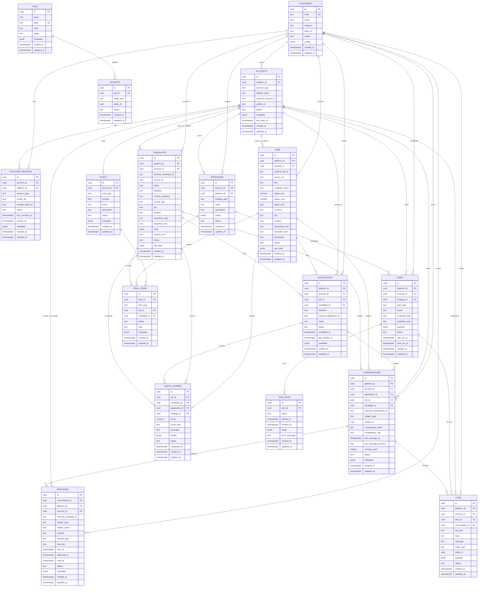

# LakeJob Core V1 ERD

本文件使用 Mermaid 描述 LakeJob Core V1 数据骨架。它只表示实体关系，不表示业务流程。

## Relationship Summary

一对多关系：

- Platform 到 Account、Job、Candidate、Conversation、Task。
- Account 到 PlatformSession、Job、Candidate、Conversation、Task、Strategy、Pool。
- Job 到 Application、MatchScore、PoolItem。
- Candidate 到 Application、MatchScore、PoolItem。
- Application 到 Conversation、MatchScore。
- Conversation 到 Message、Log。
- Strategy 到 Task、MatchScore。
- Task 到 TaskRun、Log。
- Pool 到 PoolItem。

多对多关系：

- Tag 到多个核心实体，通过 `taggings` 的 `entity_type/entity_id` 表达。
- Pool 到 Job，通过 `pool_items` 表达。
- Pool 到 Candidate，通过 `pool_items` 表达。

约束说明：

- `pool_items` 中 `item_type='job'` 时应有 `job_id`。
- `pool_items` 中 `item_type='candidate'` 时应有 `candidate_id`。
- `conversations.subject_type` 和 `subject_id` 用于未来扩展，当前仍保留直接 `job_id/candidate_id/application_id` 外键。
- `taggings.entity_id` 是多态引用，无法用单一外键表达，必须通过应用层或迁移约束维护一致性。
