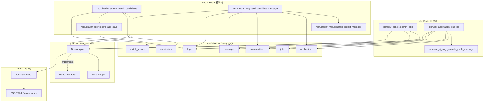
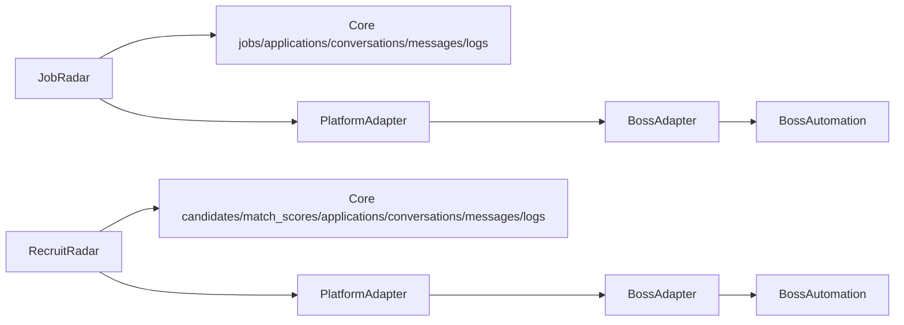

# PlatformAdapter DualRun Validation

## Scope

This document validates the single-platform, single-account dual architecture path for:

- JobRadar MVP
- RecruitRadar MVP
- LakeJob Core schema writes
- PlatformAdapter / BossAdapter boundary

No new business feature was developed.

No multi-platform, multi-account, frontend, or performance work was added.

No JobRadar or RecruitRadar business logic was modified for this validation.

## Runtime Attempt

The requested dual run was attempted with the existing CLI entrypoints.

JobRadar command:

```powershell
python jobradar_search.py Python --skills Python --limit 1
```

RecruitRadar command:

```powershell
python recruitradar_search.py Python --job-title "Backend Engineer" --skills "Python,FastAPI" --limit 1
```

Both commands failed before application code could run:

```text
python.exe cannot run: system cannot access this file
```

Known environment status:

- `py -3` previously reported `No installed Python found!`.
- No bundled Codex workspace Python runtime is configured.
- PostgreSQL connectivity was not verified at runtime.

Therefore this validation is a code-path and architecture validation, not an observed database-write run.

## Parallel Data Flow



## Dual Call Chain



Required chains:

```text
JobRadar -> Core -> PlatformAdapter -> BossAdapter -> BossAutomation
RecruitRadar -> Core -> PlatformAdapter -> BossAdapter -> BossAutomation
```

Validation result:

- JobRadar imports `BossAdapter`, not `BossAutomation`.
- RecruitRadar imports `BossAdapter`, not `BossAutomation`.
- `BossAdapter` owns the `BossAutomation` instance.
- Core writes are routed through `jobradar_log.py` and `recruitradar_log.py`.

## Core Schema Write Coverage

| Core table | JobRadar path | RecruitRadar path | Status |
|---|---|---|---:|
| `jobs` | `jobradar_search.py` -> `upsert_job()` | Not applicable | Covered by code path |
| `candidates` | Not applicable | `recruitradar_search.py` -> `upsert_candidate()` | Covered by code path |
| `applications` | `jobradar_apply.py` -> `create_application()` | `recruitradar_msg.py` -> `create_recruit_application()` | Covered by code path |
| `match_scores` | Not applicable | `recruitradar_score.py` -> `add_match_score()` | Covered by code path |
| `conversations` | `jobradar_apply.py` -> `create_conversation()` | `recruitradar_msg.py` -> `create_candidate_conversation()` | Covered by code path |
| `messages` | `jobradar_apply.py` -> `add_message()` | `recruitradar_msg.py` -> `add_message()` | Covered by code path |
| `logs` | `jobradar_search.py` / `jobradar_apply.py` -> `log_event()` | `recruitradar_search.py` / `recruitradar_msg.py` -> `log_event()` | Covered by code path |

Runtime write status:

- Not observed because Python cannot run locally.
- PostgreSQL writes were not executed.

## Mock Data Examples

### JobRadar Mock Job

The expected Core-shaped job payload for a mock JobRadar search is:

```json
{
  "external_job_id": "mock-boss-job-1",
  "source_url": "mock://boss/jobs/1",
  "title": "Backend Engineer",
  "company_name": "MockTech",
  "salary_text": "20k-35k",
  "city": "北京",
  "experience_text": "3-5年",
  "education_text": "本科",
  "description": "Python, FastAPI, PostgreSQL platform backend role.",
  "status": "active",
  "raw_data": {
    "mock": true,
    "source": "dual-run-validation"
  }
}
```

Important note:

- Current `BossAdapter.search_jobs()` still calls real `BossAutomation.search()`.
- No JobRadar mock search fallback exists today because this validation did not modify JobRadar business logic or platform search behavior.

### RecruitRadar Mock Candidate

`BossAdapter.search_candidates()` can return Core-shaped mock candidate data:

```json
{
  "external_candidate_id": "mock-boss-candidate-1",
  "source_url": "mock://boss/candidates/1",
  "name": "Mock Candidate A",
  "headline": "Backend engineer with platform experience",
  "current_company": "MockTech",
  "current_title": "Backend Engineer",
  "city": "北京",
  "location": "北京",
  "experience_text": "5年",
  "education_text": "本科",
  "skills": ["Python", "FastAPI", "PostgreSQL"],
  "resume_text": "Mock Candidate A has experience with Python Backend FastAPI.",
  "status": "active",
  "raw_data": {
    "mock": true,
    "query": "Python Backend FastAPI"
  }
}
```

### AI Message Examples

JobRadar outbound application message shape:

```json
{
  "sender_type": "ai",
  "sender_name": "JobRadar AI",
  "direction": "outbound",
  "status": "sent",
  "content": "您好，我对这个 Backend Engineer 岗位很感兴趣，我的 Python/FastAPI 经验与岗位要求较匹配，希望有机会进一步沟通。"
}
```

RecruitRadar outbound candidate message shape:

```json
{
  "sender_type": "ai",
  "sender_name": "RecruitRadar AI",
  "direction": "outbound",
  "status": "sent",
  "content": "您好，我这边有一个 Backend Engineer 机会，看到您的 Python/FastAPI 经历比较匹配，想和您简单沟通一下。"
}
```

## Architecture Verification

| Check | Result | Notes |
|---|---:|---|
| JobRadar uses BossAdapter | Passed | `jobradar_search.py` and `jobradar_apply.py` import `BossAdapter` |
| RecruitRadar uses BossAdapter | Passed | `recruitradar_search.py` and `recruitradar_msg.py` import `BossAdapter` |
| JobRadar avoids direct BossAutomation | Passed | No direct legacy import in JobRadar files |
| RecruitRadar avoids direct BossAutomation | Passed | No direct legacy import in RecruitRadar files |
| BossAdapter owns BossAutomation | Passed | `BossAdapter.__init__()` creates `BossAutomation` |
| RecruitRadar mock candidate search | Passed by code path | `BossAdapter.search_candidates()` returns mock candidates if legacy search is absent |
| JobRadar mock job search | Not implemented | Existing JobRadar path still requires real BOSS search |
| Core write coverage | Passed by code path | All required tables have writer functions |
| Runtime dual run | Blocked | Missing local Python runtime |

## Technical Debt

| Debt | Impact | Priority |
|---|---|---:|
| No local Python runtime | Cannot execute CLI, syntax checks, or DB insert validation | P0 environment |
| PostgreSQL runtime not verified | Core write coverage is static, not observed | P0 environment |
| JobRadar has no mock job search fallback | Dual mock run cannot fully execute without BOSS automation or a test harness | P0 validation |
| RecruitRadar candidate search is mock-only | Real BOSS recruiter-side candidate discovery still missing | P0 product |
| `BossAutomation` still writes legacy SQLite internally | Core is not yet the only source of truth for platform actions | P0 architecture |
| Core data layer is hand-written SQL | Needs formal Core Repository/ORM before long-term scale | P0 architecture |
| Adapter DTOs are dictionaries | Contracts are not type-enforced | P1 |
| Messaging opens conversation by display name | Needs stable platform candidate/conversation IDs | P1 |

## Conclusion

Dual architecture validation result:

```text
Code-path coverage: passed
Core schema coverage: passed by static writer-path verification
Runtime dual mock execution: blocked
```

The current LakeJob Core architecture has the intended bidirectional structure:

- JobRadar writes jobs, applications, conversations, messages, and logs through Core.
- RecruitRadar writes candidates, match_scores, applications, conversations, messages, and logs through Core.
- Both products access platform actions through BossAdapter.
- BossAdapter remains the only layer that owns BossAutomation.

The remaining blockers are environment and testability issues, not product-boundary violations:

1. Python must be installed or provided by the workspace.
2. PostgreSQL must be available with `schema.sql` applied.
3. JobRadar needs a non-production mock job source or test harness for true dual mock execution.
4. Real BOSS recruiter-side candidate automation must eventually replace RecruitRadar mock candidates.
