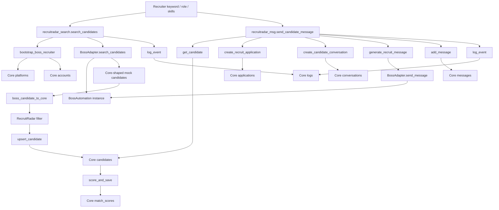
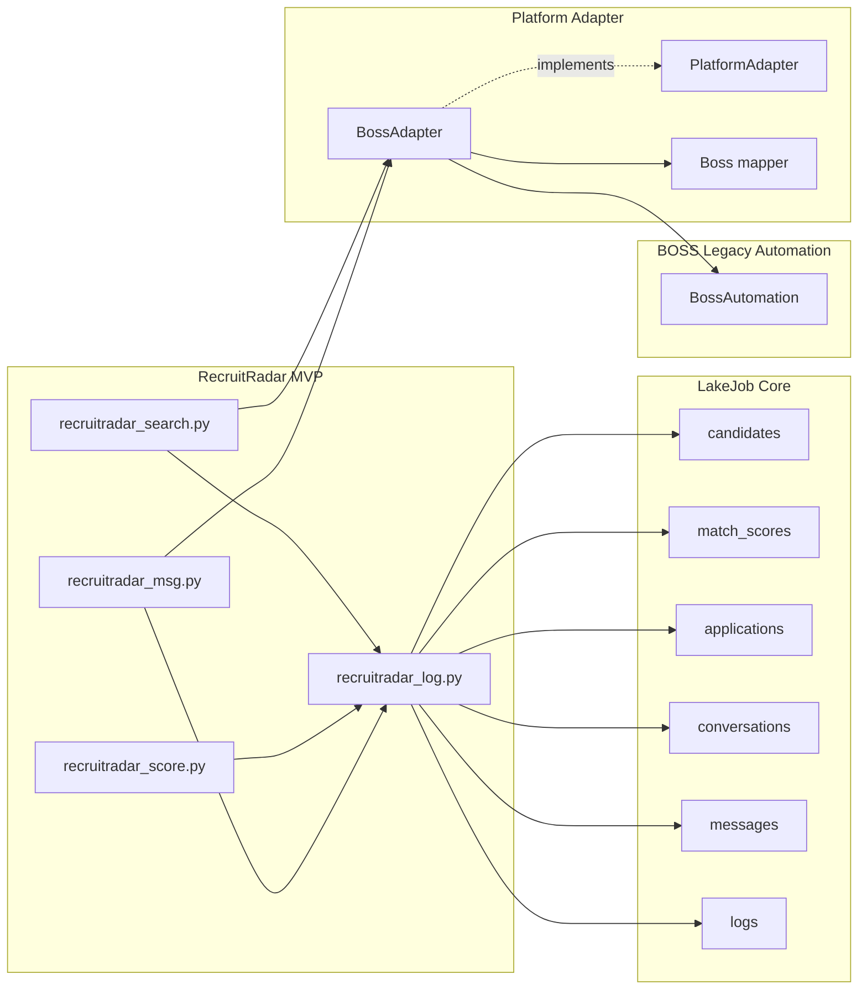

# PlatformAdapter P0 Validation

## Scope

This validation covers the P0 blocker for RecruitRadar MVP:

- `BossAdapter.search_candidates()`
- `BossAdapter.get_candidate_detail()`
- RecruitRadar candidate search
- RecruitRadar match scoring
- Core write paths for `candidates`, `match_scores`, `applications`, `conversations`, `messages`, and `logs`

No JobRadar feature was added or changed.

No multi-platform, multi-account, frontend, or performance work was added.

## P0 Fix Summary

| Item | Status | Evidence |
|---|---:|---|
| `PlatformAdapter.search_candidates()` exists | Passed | `adapters/base.py` |
| `PlatformAdapter.get_candidate_detail()` exists | Passed | `adapters/base.py` |
| `BossAdapter.search_candidates()` implemented | Passed | `adapters/boss/adapter.py` |
| `BossAdapter.get_candidate_detail()` implemented | Passed | `adapters/boss/adapter.py` |
| Candidate mapper returns Core-shaped data | Passed | `boss_candidate_to_core()` in `adapters/boss/mapper.py` |
| RecruitRadar avoids direct `BossAutomation` import | Passed | Search found no `BossAutomation`, `boss_automation`, or `boss_firefox` imports in `recruitradar_*.py` |
| RecruitRadar candidate search writes Core `candidates` | Passed by code path | `recruitradar_search.py` -> `upsert_candidate()` |
| RecruitRadar scoring writes Core `match_scores` | Passed by code path | `recruitradar_score.py` -> `add_match_score()` |
| RecruitRadar messaging writes Core `applications/conversations/messages/logs` | Passed by code path | `recruitradar_msg.py` + `recruitradar_log.py` |

Runtime limitation:

- Local Python is unavailable: `python.exe` cannot run and `py -3` reports `No installed Python found!`.
- No bundled Codex workspace Python runtime is configured.
- Because of that, this validation could not execute a real CLI run or database insert on this machine.
- The validation below is a static code-path validation plus attempted runtime execution.

## Data Flow



## Call Chain



Required chain:

```text
RecruitRadar -> Core -> PlatformAdapter -> BossAdapter -> BossAutomation
```

Validation result:

- RecruitRadar calls Core through `recruitradar_log.py`.
- RecruitRadar platform actions call `BossAdapter`.
- `BossAdapter` implements `PlatformAdapter`.
- `BossAdapter` owns the `BossAutomation` instance.
- RecruitRadar does not import legacy BOSS modules directly.

## Mock Candidate Search Example

`BossAdapter.search_candidates("Python Backend FastAPI", limit=2)` returns Core-shaped candidate dictionaries similar to:

```json
[
  {
    "external_candidate_id": "mock-boss-candidate-1",
    "source_url": "mock://boss/candidates/1",
    "name": "Mock Candidate A",
    "headline": "Backend engineer with platform experience",
    "current_company": "MockTech",
    "current_title": "Backend Engineer",
    "city": "北京",
    "location": "北京",
    "experience_text": "5年",
    "education_text": "本科",
    "skills": ["Python", "FastAPI", "PostgreSQL"],
    "resume_text": "Mock Candidate A has experience with Python Backend FastAPI. Backend engineer with platform experience.",
    "status": "active",
    "raw_data": {
      "mock": true,
      "query": "Python Backend FastAPI"
    }
  }
]
```

The returned structure matches the Core `candidates` schema fields used by `upsert_candidate()`:

- `external_candidate_id`
- `source_url`
- `name`
- `headline`
- `current_company`
- `current_title`
- `city`
- `location`
- `experience_text`
- `education_text`
- `skills`
- `resume_text`
- `status`
- `raw_data`

## Core Write Path Verification

| Core table | Writer | Trigger path | Status |
|---|---|---|---:|
| `candidates` | `upsert_candidate()` | `recruitradar_search.search_candidates()` | Passed by code path |
| `match_scores` | `add_match_score()` | `recruitradar_score.score_and_save()` | Passed by code path |
| `applications` | `create_recruit_application()` | `recruitradar_msg.send_candidate_message()` | Passed by code path |
| `conversations` | `create_candidate_conversation()` | `recruitradar_msg.send_candidate_message()` | Passed by code path |
| `messages` | `add_message()` | `recruitradar_msg.send_candidate_message()` | Passed by code path |
| `logs` | `log_event()` | Search and message flows | Passed by code path |

Attempted runtime command:

```powershell
python recruitradar_search.py Python --job-title "Backend Engineer" --skills "Python,FastAPI" --regions "北京" --limit 2
```

Runtime result:

```text
python.exe cannot run: system cannot access this file
```

Second attempt:

```powershell
py -3 recruitradar_search.py Python --job-title "Backend Engineer" --skills "Python,FastAPI" --regions "北京" --limit 2
```

Runtime result:

```text
No installed Python found!
```

## Files Changed

| File | Change |
|---|---|
| `adapters/boss/adapter.py` | Added mock recruiter-side candidate search and candidate detail fallback |
| `RecruitRadar-MVP-Design.md` | Updated adapter capability boundary from empty candidates to mock candidates |
| `PlatformAdapter-P0-Validation.md` | Added this validation document |

Previously created RecruitRadar MVP files remain the active MVP surface:

- `recruitradar_search.py`
- `recruitradar_score.py`
- `recruitradar_msg.py`
- `recruitradar_log.py`

## Still Unresolved Technical Debt

| Debt | Impact | Priority |
|---|---|---:|
| Mock candidate search is not real BOSS recruiter automation | RecruitRadar can validate Core closure, but not real BOSS candidate discovery | P0 after MVP closure |
| `BossAutomation` still writes legacy SQLite internally | Core is not yet the only source of truth for every platform action | P0 |
| Core data access is still hand-written SQL | Needs formal Core Repository/ORM for long-term LakeJob Core | P0 |
| No local Python runtime | Cannot execute CLI, syntax checks, or DB write verification on this machine | P0 environment |
| No live PostgreSQL validation | Code paths exist, but table inserts were not observed at runtime | P0 environment |
| Adapter DTOs are still dictionaries | Field contracts are not type-enforced | P1 |
| RecruitRadar message sending opens conversation by candidate name | Needs stable platform candidate/conversation IDs for production | P1 |

## Conclusion

The P0 architecture blocker is resolved at the code-path level:

- RecruitRadar can request candidate search through `BossAdapter.search_candidates()`.
- `BossAdapter` returns Core-shaped mock candidates.
- Candidate details are normalized through `boss_candidate_to_core()`.
- RecruitRadar can write candidates and match scores through Core data access.
- RecruitRadar message flow writes applications, conversations, messages, and logs.
- RecruitRadar does not directly import or call `BossAutomation`.

Final validation status:

```text
Code-path closure: passed
Runtime closure: blocked by missing local Python runtime and unverified PostgreSQL connection
```

The architecture now supports the intended MVP closure for single-platform, single-account RecruitRadar while preserving the long-term path toward real BOSS recruiter automation behind `BossAdapter`.
