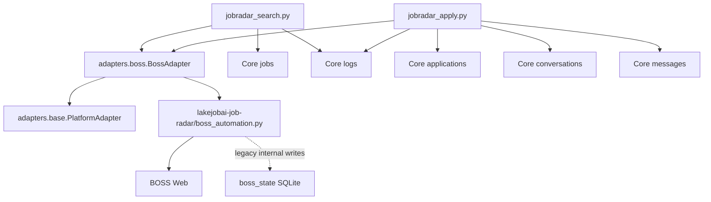

# PlatformAdapter Refactor

目标：修复 JobRadar MVP 的平台调用地基，使调用链变为：

```text
JobRadar -> PlatformAdapter -> BossAdapter -> BossAutomation
```

本次范围：

- 创建正式 `PlatformAdapter` 抽象接口。
- 创建 `BossAdapter`，内部封装现有 `BossAutomation`。
- 创建 Boss mapper，把 Boss 原始数据转换为 Core 标准结构。
- 修改 JobRadar MVP，不再直接 import 或调用 `BossAutomation`。
- 投递消息生成后写入 Core `messages` 表。
- 不开发新业务功能。
- 不开发 RecruitRadar。
- 不开发多平台。
- 不开发前端。

## 新调用链



## 修改了哪些文件

新增文件：

| 文件 | 说明 |
|---|---|
| `adapters/__init__.py` | 平台适配器包入口 |
| `adapters/base.py` | `PlatformAdapter` 抽象接口 |
| `adapters/boss/__init__.py` | Boss adapter 包入口 |
| `adapters/boss/adapter.py` | `BossAdapter`，封装 `BossAutomation` |
| `adapters/boss/mapper.py` | Boss 原始数据到 Core 标准数据结构的 mapper |
| `PlatformAdapter-Refactor.md` | 本重构说明 |

修改文件：

| 文件 | 修改内容 |
|---|---|
| `jobradar_search.py` | 移除 `BossAutomation` 和 `boss_firefox.CITIES` 直接导入，改为调用 `BossAdapter.search_jobs()` |
| `jobradar_apply.py` | 移除 `BossAutomation` 直接导入，改为调用 `BossAdapter.apply_to_job()` |
| `jobradar_apply.py` | AI 投递消息生成后写入 Core `messages` 表 |
| `jobradar_log.py` | 新增 `create_conversation()` 和 `add_message()`，用于 Core `conversations/messages` 写入 |

未修改：

- 未修改 `lakejobai-job-radar/boss_automation.py`。
- 未修改 `lakejobai-job-radar/boss_firefox.py`。
- 未修改 BossAdapter 底层旧实现。
- 未修改 Core `schema.sql`。

## PlatformAdapter 接口

`adapters/base.py` 定义：

| 方法 | 用途 |
|---|---|
| `start()` | 启动 adapter 运行资源 |
| `close()` | 释放 adapter 运行资源 |
| `search_jobs()` | 搜索岗位 |
| `get_job_detail()` | 获取岗位详情 |
| `apply_to_job()` | 投递岗位 |
| `fetch_conversations()` | 获取会话列表 |
| `send_message()` | 发送消息 |
| `get_account_status()` | 获取账号/会话状态 |

## BossAdapter 当前能力边界

当前 `BossAdapter` 是现有 `BossAutomation` 的封装层。

已封装能力：

| BossAdapter 方法 | 内部调用 |
|---|---|
| `search_jobs()` | `BossAutomation.search()` |
| `get_job_detail()` | `BossAutomation.fetch_detail()` |
| `apply_to_job()` | `BossAutomation.apply_to_job()` |
| `fetch_conversations()` | `BossAutomation.poll_conversation_list()` |
| `send_message()` | `BossAutomation.open_conversation_by_name()` + `send_message()` |
| `get_account_status()` | `BossAutomation.check_logged_in()` |

当前限制：

- 仍然只支持 BOSS。
- 仍然只支持单账号运行方式。
- 仍依赖现有 Playwright 同步自动化。
- 仍依赖 `lakejobai-job-radar` 目录里的旧代码。
- 仍会受到 BOSS 页面结构变化影响。

## Mapper 边界

`adapters/boss/mapper.py` 负责把 BOSS 原始数据转换为 Core 标准结构：

| Mapper | 输出 |
|---|---|
| `boss_job_to_core()` | Core Job-shaped dict |
| `boss_conversation_to_core()` | Core Conversation-shaped dict |
| `boss_message_to_core()` | Core Message-shaped dict |

JobRadar 现在接收的是 Core-shaped 数据，不再直接处理 Boss 原始字段。

## 哪些直接调用被移除

已移除：

| 文件 | 移除内容 |
|---|---|
| `jobradar_search.py` | `from boss_automation import BossAutomation` |
| `jobradar_search.py` | `from boss_firefox import CITIES` |
| `jobradar_apply.py` | `from boss_automation import BossAutomation` |

替换为：

```python
from adapters.boss import BossAdapter
```

当前验证结果：

- `jobradar_search.py` 不再直接 import `BossAutomation`。
- `jobradar_apply.py` 不再直接 import `BossAutomation`。
- 平台相关调用进入 `BossAdapter`。

## AI 消息写入 Core messages

修复前：

- `jobradar_ai_msg.generate_apply_message()` 返回文本。
- `jobradar_apply.py` 只把文本传给 `BossAutomation.apply_to_job()`。
- 消息只存在于 `logs.payload`。
- Core `messages` 表没有记录。

修复后：

1. `jobradar_apply.py` 创建 Core `applications`。
2. `jobradar_apply.py` 创建 Core `conversations`。
3. `jobradar_apply.py` 将 AI 生成的投递消息写入 Core `messages`。
4. `jobradar_apply.py` 调用 `BossAdapter.apply_to_job()`。
5. `jobradar_apply.py` 写入 Core `logs`，并附带 `message_id`。

当前写入链：

```text
generate_apply_message()
-> create_conversation()
-> add_message()
-> BossAdapter.apply_to_job()
-> log_event()
```

## 仍然存在的技术债

### TD-01: BossAutomation 内部仍写旧 SQLite

`BossAdapter` 内部调用的 `BossAutomation` 仍会写旧 `boss_state.py`：

- `add_application`
- `update_application_status`
- `get_or_create_conversation`
- `add_message`
- `replace_conversation_messages`
- `increment_daily_stat`

当前处理：

- JobRadar 不再直接依赖旧 SQLite。
- 旧 SQLite 写入被隔离在 `BossAdapter -> BossAutomation` 内部。
- 文档明确标记为技术债。

后续必须修复：

- 将 `BossAutomation` 改为纯平台动作层，只返回结果，不写状态库。
- 或创建无状态 Boss automation runner，完全移除旧 `boss_state` 依赖。

### TD-02: BossAdapter 仍直接依赖 legacy 目录

`adapters/boss/adapter.py` 通过 `sys.path` 指向 `lakejobai-job-radar`。

后续必须修复：

- 将 Boss 自动化实现迁入正式 `adapters/boss/`。
- 删除 `sys.path` 注入。

### TD-03: Core 数据访问仍是手写 SQL

`jobradar_log.py` 仍是最小 schema access，不是真正 ORM/Repository。

后续必须修复：

- 创建 Core Repository。
- JobRadar 只调用 Repository，不散写 SQL。

### TD-04: Conversation 当前是投递前本地创建

当前 `jobradar_apply.py` 在调用平台投递前创建 Core conversation。

风险：

- 如果 BOSS 投递失败，Core conversation 仍然存在。
- conversation 还没有真实 `external_conversation_id`。

后续必须修复：

- BossAdapter 返回平台会话标识。
- Core conversation 与平台 conversation 做同步绑定。

### TD-05: Product 状态映射仍在 JobRadar 脚本内

`Applied / Waiting / Interview / Rejected` 与 Core `submitted / pending / responded / rejected` 的映射还在 `jobradar_apply.py`。

后续必须修复：

- 建立统一状态 mapper。
- 或在 Core 中增加 product status metadata 规范。

## 验收结论

本次重构完成后，调用边界从：

```text
JobRadar -> BossAutomation
```

变为：

```text
JobRadar -> PlatformAdapter -> BossAdapter -> BossAutomation
```

同时：

- JobRadar 不再直接 import `BossAutomation`。
- Boss 原始数据映射集中到 `adapters/boss/mapper.py`。
- AI 投递消息会写入 Core `messages`。
- 旧 SQLite 写入没有被隐藏，已明确标记为 BossAutomation 内部技术债。

当前架构地基比验收前更接近长期演化要求，但还没有完全达到最终 Core 形态。下一步必须处理的是：让 BossAutomation 停止写旧 SQLite，并建立正式 Core Repository。
