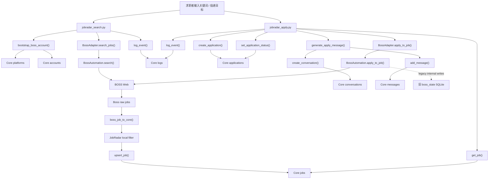
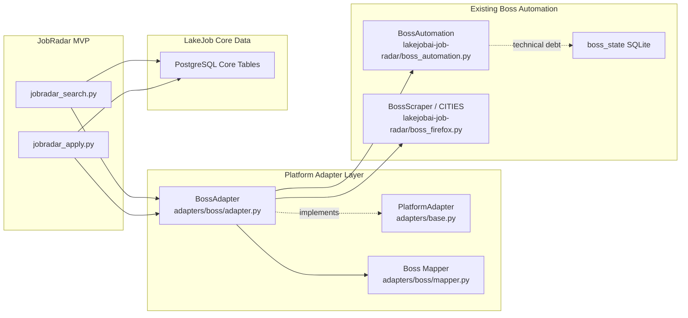

# PlatformAdapter Validation

## 验收范围

本次验收只检查 LakeJob Core + BossAdapter + JobRadar MVP 的二次架构闭环。

禁止项已遵守：

- 未开发新功能。
- 未修改 JobRadar 业务逻辑。
- 未涉及 RecruitRadar、多账号或多平台实现。
- 未修改 BossAdapter、BossAutomation 或 Core 数据库结构。

验收方式：

- 静态阅读 `jobradar_search.py`、`jobradar_apply.py`、`jobradar_log.py`。
- 静态阅读 `adapters/base.py`、`adapters/boss/adapter.py`、`adapters/boss/mapper.py`。
- 使用代码搜索确认 JobRadar 是否仍直接依赖 `BossAutomation`。

限制说明：

- 当前环境没有可用 Python 运行时，未执行端到端运行测试。
- 未连接真实 PostgreSQL、BOSS 页面或 AI 服务。
- 结论基于代码路径验收，不等同于真实生产链路压测。

## A. 当前数据流图



## B. 当前调用链图



目标调用链已经形成：

```text
JobRadar -> PlatformAdapter -> BossAdapter -> BossAutomation
```

当前代码中，`jobradar_search.py` 和 `jobradar_apply.py` 只 import `BossAdapter`，不再直接 import `BossAutomation`。

## C. 核心功能写入 Core 表状态检查

| 验收项 | 结果 | 依据 |
|---|---:|---|
| JobRadar 搜索岗位是否写入 `jobs` 表 | 通过 | `jobradar_search.py` 调用 `upsert_job()`；`jobradar_log.py` 中 `upsert_job()` 执行 `INSERT INTO jobs ... ON CONFLICT ...` |
| JobRadar 投递状态是否写入 `applications` 表 | 通过 | `jobradar_apply.py` 调用 `create_application()` 和 `set_application_status()`；两者都写 Core `applications` |
| AI 投递消息是否写入 `messages` 表 | 通过 | `jobradar_apply.py` 调用 `generate_apply_message()` 后立即调用 `add_message()`；`jobradar_log.py` 写入 Core `messages` |
| 日志是否写入 `logs` 表 | 通过 | 搜索和投递流程均调用 `log_event()`；`jobradar_log.py` 写 Core `logs` |
| BossAdapter 是否真正被 JobRadar 调用 | 通过 | `jobradar_search.py`、`jobradar_apply.py` 都实例化并调用 `BossAdapter` |
| JobRadar 是否仍直接调用 `BossAutomation` | 通过 | 代码搜索未发现 `jobradar_*.py` 直接 import `BossAutomation` |
| 是否完全消除旧 SQLite 写入 | 未通过 | `BossAutomation` 内部仍调用 `boss_state`，但该依赖已被隔离在 BossAdapter 之后 |

结论：JobRadar MVP 的 Core 写表路径已经补齐，但真实写入成功仍依赖 PostgreSQL schema 已初始化、数据库连接可用、BOSS 页面可访问、AI 服务可访问。

## D. Mapper 验收

| Mapper | 结果 | 当前状态 | 风险 |
|---|---:|---|---|
| Boss Job -> Core Job | 部分通过 | `boss_job_to_core()` 映射 `external_job_id`、`source_url`、`title`、`company_name`、`salary_text`、`city`、`experience_text`、`education_text`、`description`、`status`、`raw_data` | 未拆分薪资数值、地区标准化、职位类别；`platform_id/account_id` 由写库层补齐，不在 mapper 内 |
| Boss Candidate -> Core Candidate | 未通过 | 当前没有 `boss_candidate_to_core()` | JobRadar MVP 暂不需要候选人，但未来 RecruitRadar / 候选池无法复用现有 mapper |
| Boss Message -> Core Message | 部分通过 | `boss_message_to_core()` 映射 `external_message_id`、`sender_type`、`sender_name`、`content`、`content_type`、`direction`、`status`、`metadata` | 缺少稳定 conversation 绑定；只支持文本消息；附件、简历、系统消息未建模 |
| Boss Conversation -> Core Conversation | 部分通过 | `boss_conversation_to_core()` 映射 `external_conversation_id`、`subject_type`、`counterparty_name`、`counterparty_role`、`last_message_preview`、`unread_count`、`status`、`metadata` | `external_conversation_id` 可能为空；无法稳定绑定 job/application/candidate |

Mapper 结论：

- Job、Message、Conversation 已有基础 Core-shaped 映射。
- Candidate 映射不存在，这是本次验收的明确缺口。
- 当前 mapper 更像 MVP 兼容层，还不是长期稳定的平台标准化层。

## E. 架构缺陷清单

| 编号 | 缺陷 | 影响 | 严重级别 |
|---|---|---|---:|
| D-01 | `BossAutomation` 内部仍写旧 `boss_state` SQLite | Core 不是唯一事实来源，可能出现双写不一致 | P0 |
| D-02 | 缺少 `boss_candidate_to_core()` | 未来 RecruitRadar、候选池、候选搜索无法接入统一 mapper | P0 |
| D-03 | Core 数据访问集中在 `jobradar_log.py` 手写 SQL | 产品层和 Core Repository 边界不清晰 | P0 |
| D-04 | `BossAdapter` 通过 `sys.path` 引入 legacy repo | 依赖边界脆弱，不利于包化和部署 | P1 |
| D-05 | `apply_one_job()` 先写 conversation/message，再执行平台投递 | 平台投递失败时会留下已生成的出站消息 | P1 |
| D-06 | `BossAdapter.apply_to_job()` 依赖 `job["source_url"]` 字典键 | 缺少强类型契约，错误会在运行时暴露 | P1 |
| D-07 | 投递状态映射在 `jobradar_apply.py` 本地维护 | 平台状态和 Core 状态映射未集中治理 | P1 |
| D-08 | `jobs` 写入成功与否缺少运行时验收脚本 | 当前只能静态证明代码路径存在 | P2 |
| D-09 | `tasks/task_runs` 未接入搜索和投递流程 | 未来定时任务和审计链路仍需补齐 | P2 |

## F. 未来扩展阻塞项

| 阻塞项 | 阻塞的未来能力 | 原因 |
|---|---|---|
| 旧 SQLite 双写 | 多账号、多平台、统一审计 | 状态可能分散在 Core 和 legacy SQLite |
| 缺少 Candidate mapper | RecruitRadar、候选池、AI 匹配 | 无法把平台候选人标准化为 Core Candidate |
| 缺少 Core Repository/ORM | 所有产品共享底座 | 当前 `jobradar_log.py` 是 MVP 数据接口，不是 Core 模块 |
| 缺少强类型 Adapter DTO | 猎聘/智联接入 | 平台返回 dict，字段契约不稳定 |
| 缺少事务边界 | 投递闭环可靠性 | application、message、platform apply、log 之间可能不一致 |
| Conversation 外部 ID 不稳定 | 自动聊天、消息同步 | 无法可靠去重和增量同步 |

## G. 必须重构项

| 优先级 | 重构项 | 验收标准 |
|---:|---|---|
| P0 | 移除或禁用 `BossAutomation` 内部旧 SQLite 写入 | 平台动作只返回结果，所有状态只写 Core |
| P0 | 建立正式 Core Repository/ORM | JobRadar 不再直接维护 SQL；所有表写入经 Core 数据层 |
| P0 | 增加 Candidate 标准 mapper | `Boss Candidate -> Core Candidate` 有明确字段契约 |
| P1 | 定义 Adapter DTO / Schema | `search_jobs()`、`apply_to_job()`、`fetch_conversations()` 返回结构稳定 |
| P1 | 重构投递事务边界 | 平台投递失败时不会留下误导性的消息和状态 |
| P1 | 集中管理平台状态映射 | BOSS、猎聘、智联未来共享 Core 状态枚举 |
| P2 | 接入 `tasks` / `task_runs` | 自动搜索、自动投递、定时任务有统一执行记录 |
| P2 | 建立运行时验收脚本 | 能真实验证 jobs/applications/messages/logs 写入 |

## H. 验证结论

二次验收结论：**JobRadar MVP 已经形成结构上的封装闭环，但还不能视为完全具备长期演化能力。**

已经通过的部分：

- JobRadar 不再直接 import `BossAutomation`。
- 平台调用链已经变为 `JobRadar -> BossAdapter -> BossAutomation`。
- `PlatformAdapter` 抽象接口已经存在。
- 搜索结果有 Core `jobs` 写入路径。
- 投递状态有 Core `applications` 写入路径。
- AI 投递消息有 Core `messages` 写入路径。
- 搜索和投递均有 Core `logs` 写入路径。

未通过或仅部分通过的部分：

- `BossAutomation` 仍然会写旧 SQLite，这是当前最大架构债。
- `Boss Candidate -> Core Candidate` mapper 不存在。
- Core 数据访问还不是正式 Core Repository/ORM。
- Mapper 是 MVP 级字段转换，不是完整平台标准化层。
- 缺少运行时端到端验收，无法确认真实数据库写入成功。

最终判断：

当前架构可以支撑 **JobRadar 单平台单账号 MVP 的下一步验证**。

但要成为未来 LakeJob Core 的长期共享底座，必须先完成 P0 重构：

1. 让 `BossAutomation` 停止写旧 SQLite。
2. 建立正式 Core Repository/ORM。
3. 补齐 Candidate mapper。
4. 为 Adapter 返回值建立稳定类型契约。

在这些问题修复前，当前架构只能算“已完成封装闭环的 MVP 地基”，不能算“可长期稳定演化的 LakeJob Core”。
