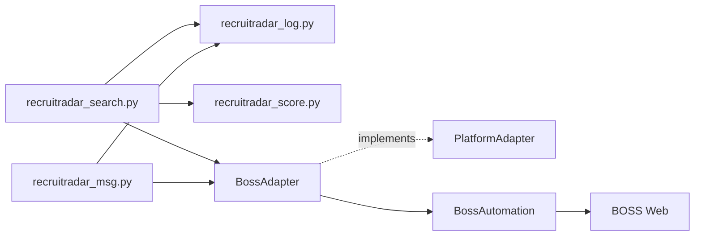
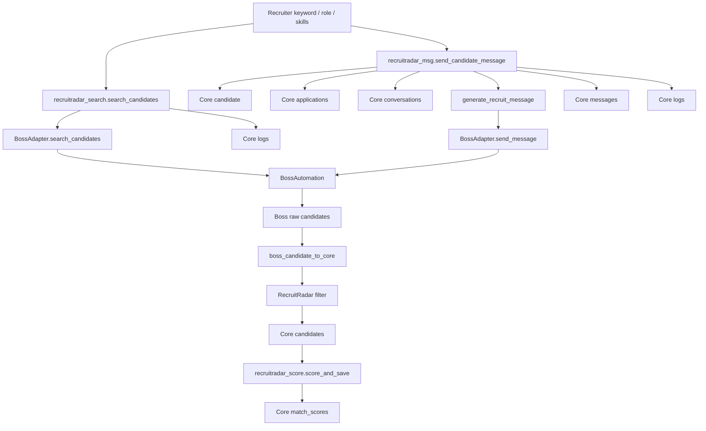

# RecruitRadar MVP Design

## Scope

RecruitRadar MVP is a single-platform and single-account recruiter-side flow on top of LakeJob Core and BossAdapter.

Implemented scope:

- Search candidates through `BossAdapter.search_candidates()`.
- Save candidates into Core `candidates`.
- Filter candidates by skills, regions, and experience.
- Score and sort candidates.
- Save scoring results into Core `match_scores`.
- Generate recruiter messages.
- Send messages through `BossAdapter.send_message()`.
- Save recruiter-side applications into Core `applications`.
- Save conversations and messages into Core `conversations/messages`.
- Save audit logs into Core `logs`.

Not implemented:

- Multi-platform.
- Multi-account.
- RecruitRadar API or frontend.
- New BOSS selectors.
- Direct calls from RecruitRadar to `BossAutomation`.

## Module Boundary

| File | Responsibility |
|---|---|
| `recruitradar_search.py` | Candidate search, local filtering, Core candidate write, scoring orchestration |
| `recruitradar_score.py` | Rule-based candidate scoring and `match_scores` write |
| `recruitradar_msg.py` | AI/fallback recruiter message generation, send action, Core conversation/message/application/log write |
| `recruitradar_log.py` | RecruitRadar Core data access for recruiter account, candidates, applications, conversations, messages, scores, logs |
| `adapters/base.py` | PlatformAdapter contract with candidate search/detail methods |
| `adapters/boss/adapter.py` | BOSS adapter wrapper around legacy BossAutomation |
| `adapters/boss/mapper.py` | Boss raw data to Core-shaped Job/Candidate/Conversation/Message mapping |

## Call Chain



Required product chain:

```text
RecruitRadar -> LakeJob Core -> PlatformAdapter -> BossAdapter -> BossAutomation
```

Current code satisfies the import boundary:

- RecruitRadar imports `BossAdapter`.
- RecruitRadar does not import `BossAutomation`.
- Core writes are isolated in `recruitradar_log.py`.

## Data Flow



## Core Table Writes

| Table | Writer | Status |
|---|---|---|
| `accounts` | `ensure_recruiter_account()` | Creates single BOSS recruiter account |
| `candidates` | `upsert_candidate()` | Saves mapped candidate profiles |
| `match_scores` | `add_match_score()` | Saves rule score for each candidate |
| `applications` | `create_recruit_application()` | Saves recruiter-side outreach state |
| `conversations` | `create_candidate_conversation()` | Saves candidate conversation shell |
| `messages` | `add_message()` | Saves outbound AI recruiter message |
| `logs` | `log_event()` | Saves search and message audit events |

## Adapter Capability Boundary

`BossAdapter.search_candidates()` exists and is the only RecruitRadar candidate search entrypoint.

Important limitation:

- The existing legacy `BossAutomation` does not currently expose real candidate search.
- `BossAdapter.search_candidates()` therefore returns Core-shaped mock candidates until a real BOSS candidate search method is added inside the adapter/legacy automation layer.
- RecruitRadar does not bypass this boundary.

This keeps the architecture correct while making the missing BOSS recruiter-side automation explicit.

## MVP Test Paths

Search candidates:

```powershell
python recruitradar_search.py "Python" --job-title "Backend Engineer" --skills "Python,FastAPI" --regions "北京" --limit 10
```

Score candidates:

```powershell
python recruitradar_score.py --candidates-json "[{""id"":""candidate-id"",""name"":""Alice"",""skills"":[""Python""]}]" --skills "Python,FastAPI"
```

Send message:

```powershell
python recruitradar_msg.py candidate-id --message-type invite --job-title "Backend Engineer" --skills "Python,FastAPI"
```

Runtime prerequisites:

- `LAKEJOB_DATABASE_URL` or `DATABASE_URL` points to a PostgreSQL database initialized with `schema.sql`.
- `psycopg` or `psycopg2` is installed.
- BOSS browser session is available for platform actions.
- `LAKEJOB_AI_API_KEY` or `OPENAI_API_KEY` is optional; without it, RecruitRadar uses a deterministic fallback message.

## Technical Debt

| Debt | Impact | Priority |
|---|---|---:|
| Legacy `BossAutomation` lacks real candidate search | RecruitRadar uses mock candidates until BOSS recruiter automation is implemented | P0 |
| `BossAutomation` still writes old SQLite internally | Core may not be the only source of truth for platform actions | P0 |
| Core data access is hand-written SQL | Needs formal Core Repository/ORM before scale-up | P0 |
| Adapter DTOs are dictionaries | Field contracts are runtime-only | P1 |
| Message send uses candidate name to open conversation | Needs stable platform conversation/candidate IDs | P1 |
| Scoring is rule-based only | AI scoring can be added later through Core strategy, not in this MVP | P2 |

## Validation Conclusion

RecruitRadar MVP now has a Core-first data skeleton and follows the required adapter boundary.

It is ready for architecture-level iteration, but not ready for real recruiter production use until BOSS recruiter-side candidate search is implemented inside `BossAdapter/BossAutomation`.
